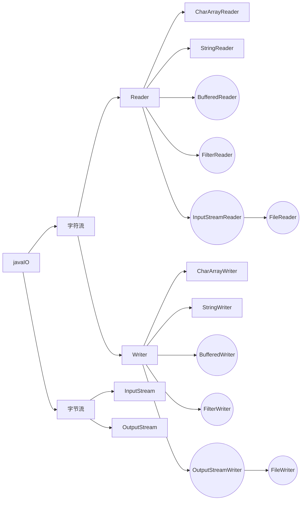
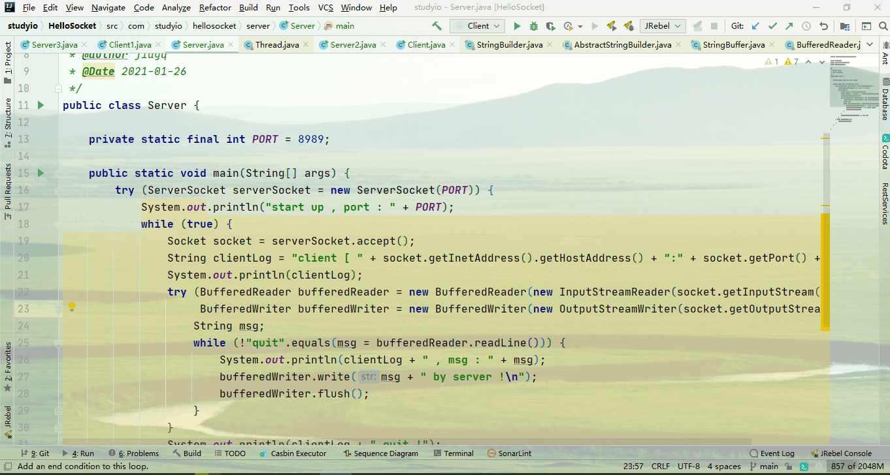
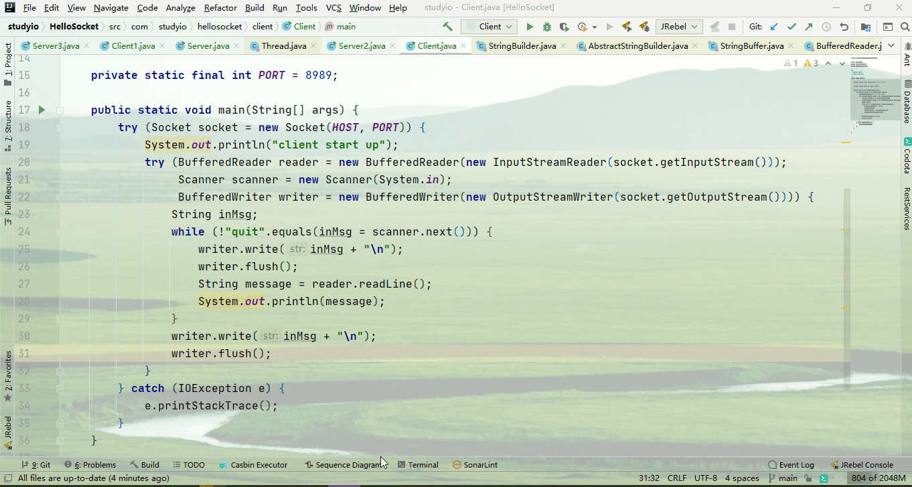
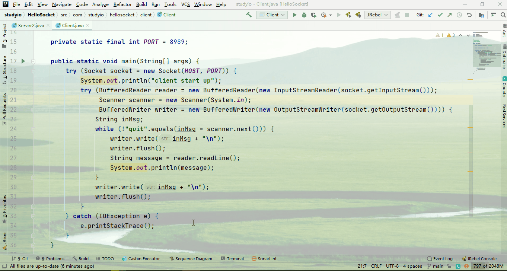
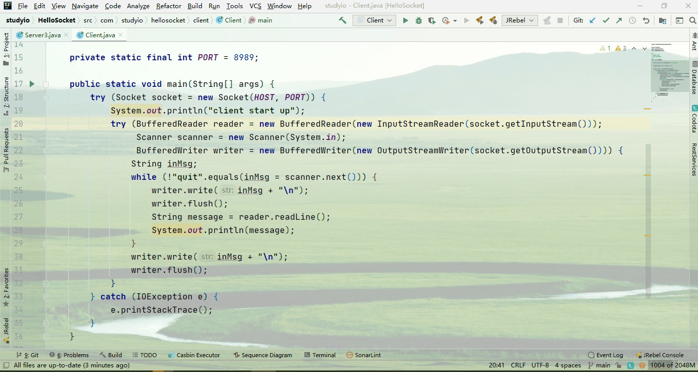
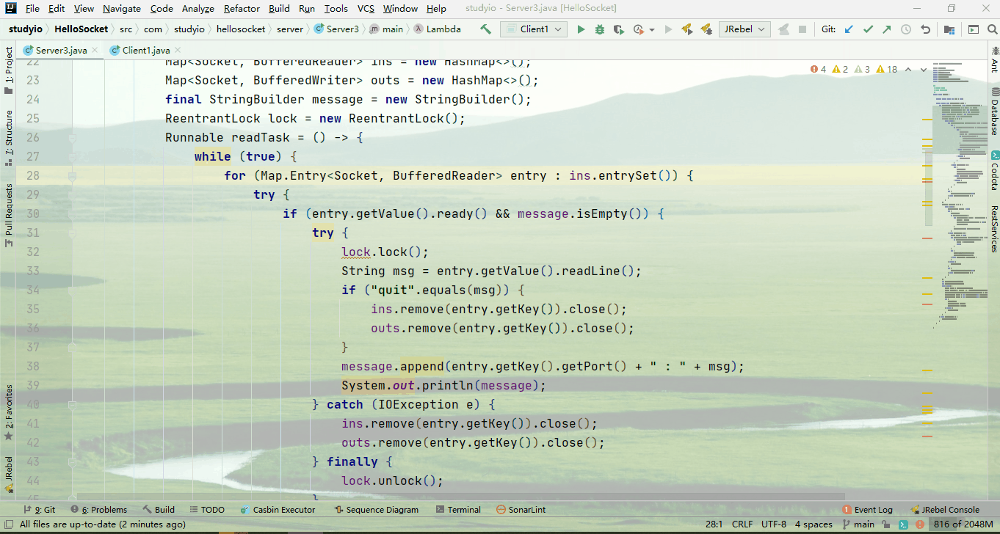
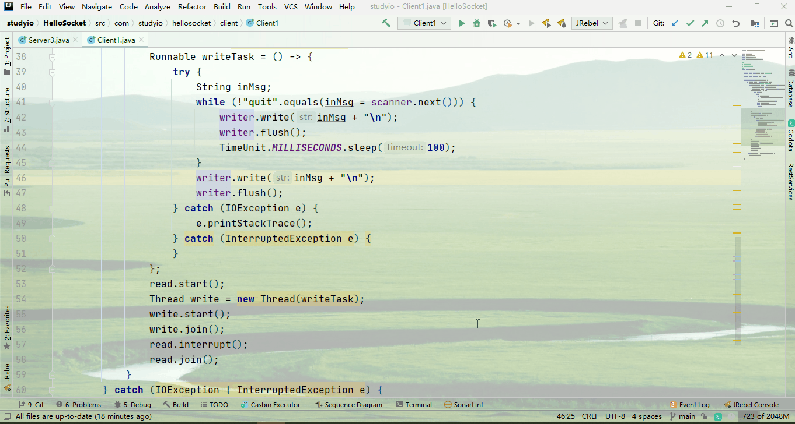
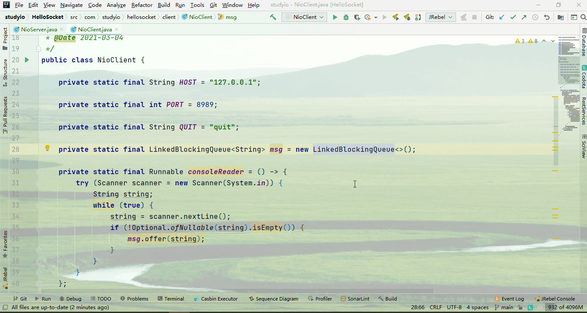
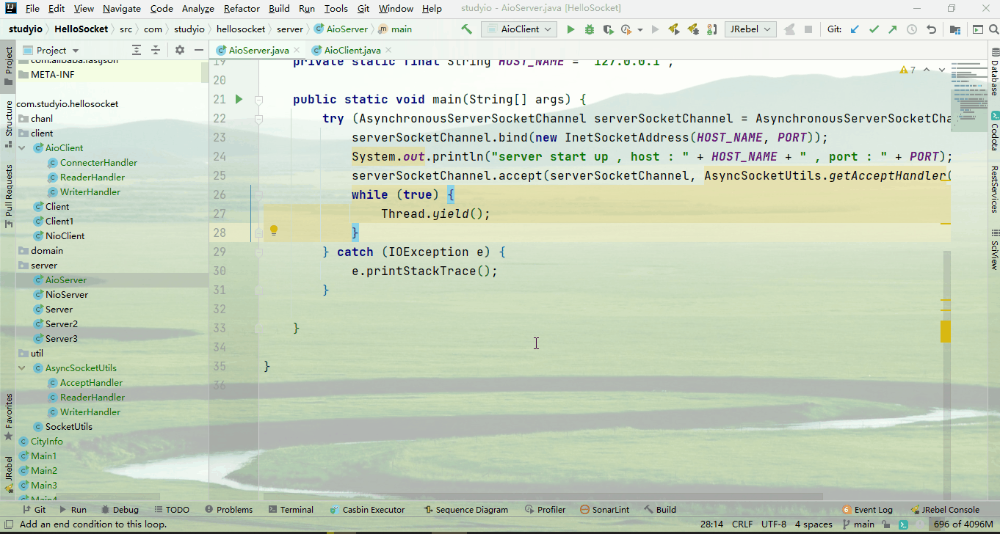

[TOC]

github地址：

https://github.com/a18792721831/studyio.git


# IO 发展

- BIO

  Blocked IO.阻塞IO.

  jdk 1.4之前

- NIO

  No-Blocked IO.非阻塞IO.

  jdk 1.4之后

- AIO

  Asynchronizated IO.异步IO.

  jdk 1.7之后


NIO 和AIO 有什么区别？

非阻塞不就是异步吗？

首先阻塞和非阻塞是站在调用者的角度描述的。

同步和异步是描述调用方式的。

阻塞和同步是同一个事情的不同角度的描述。

**同步阻塞**

假设A调用B，在B返回之前什么事情都不干。在B返回后，A在接着干活。

这种调用机制是同步机制。对于A来说是阻塞的。即同步阻塞。

在单线程中一般同步必然阻塞。而阻塞也基本上是同步导致的。

**同步非阻塞**

假设A调用B，在B返回之前还能干其他的事情。在B返回后，A可以接着调用的地方继续干活。

这种调用机制是同步机制。对于A来说是阻塞的。即同步非阻塞。

在多线程中一般同步不一定阻塞。而阻塞也不一定是同步导致。(也可能线程调度导致)


对于同步，被调用者只会返回结果，在返回结果前，什么都不会告诉调用者。

**异步阻塞**

假设A调用B，B收到请求后，即可向A确定，我已收到请求，正在处理。而A在收到B的结果之前，什么都不干。

这种调用机制是异步机制。对于A来说是阻塞的。异步阻塞。

比如在多线程中进行耗时计算。假设有两个线程，A线程将一个表达式传给B线程进行计算，而B线程在收到调用后，立刻给了A线程一个对象，告诉A线程我计算完成后会放在这个对象中，你在我计算完成后从对象中取计算结果。

但是A线程在没有得到计算结果之前，什么都干不了，只能隔一段时间看看B是否计算完成。

**异步非阻塞**

假设A调用B，B收到请求后，立刻向A确定，我已收到请求，正在处理。而A在收到B的结果之前，还可以做其他的事情。

这种调用机制是异步机制。对于A来说是非阻塞的。异步非阻塞。

比如A线程需要计算两个表达式的和，而这两个表达式计算都比较耗费时间。于是A线程将第一个等式交给了B线程，然后将第二个等式交给了C线程。

在A调用B线程计算第一个表达式的值的时候，A线程得到了未来存储结果的对象。然后A线程现将对象保存起来，接着将第二个表达式交给C线程，C线程也交给A一个对象，这个对象未来存储计算结果。

然后A线程将第一个表达式的结果对象第二个表达式的结果对象统一交给D线程，D线程遍历查看是否计算完成，如果计算完成，那么进行表达式结果的汇总。

而A线程在完成调用后，就去调用第二组数据了。

这就是异步非阻塞。

# BIO

## 设计思想

客户端发起一个请求，服务端接受这个请求，然后创建一个线程用于处理这个请求。当客户端断开连接后，服务端销毁线程。

因为创建和销毁线程耗费的资源比较高，因此，使用线程池可以节省资源。

## 核心类

### Socket

目前计算机网络分为5层结构(有些资料上分为7层)

分别是物理层，链路层，网络层，传输层，应用层

- 物理层：就是网线，光纤，交换机等等物理设备。
- 链路层：二进制数据帧，不同网卡数据进行发送与接收
- 网络层：IP，不同主机进行区分，选择传输路径。
- 传输层：TCP/UDP，选择连接模式
- 应用层：HTTP/FTP/STMP/POP3，具体的应用


基于计算机网络，物理层没有身份识别问题，就是物理空间上的关系。

链路层身份识别使用mac地址。网络层身份识别是IP地址。

传输层识别TCP/UDP表头。

应用层则是通过端口来识别应用程序进程。


换句话说，当我们知道一个主机的IP,端口和协议，我们就能确定唯一的一个应用程序。

比如:`http://www.baidu.com`

我们就可以确定这是位于www.baidu主机的80端口对应的程序，这个程序使用的是http协议。


而IP和端口是这些较为底层的基础组件。

就是Socket，翻译是套接字。

用套接字有些抽象。但是也没啥好的翻译。但是我们应该理解，当我们得到了一个套接字，我们就能确定一个应用程序。

### IO 流



非常多，不计其数


## BIO实例 -- 多人聊天室

客户端：

Socket

服务端：

ServerSocket.

写一个小小的实例：客户端与服务端通信的实例

### 客户端服务端双阻塞

```java
public class Server {

    private static final int PORT = 8989;

    public static void main(String[] args) {
        try (ServerSocket serverSocket = new ServerSocket(PORT)) {
            System.out.println("start up , port : " + PORT);
            while (true) {
                Socket socket = serverSocket.accept();
                String clientLog = "client [ " + socket.getInetAddress().getHostAddress() + ":" + socket.getPort() + "] ";
                System.out.println(clientLog);
                try (BufferedReader bufferedReader = new BufferedReader(new InputStreamReader(socket.getInputStream()));
                     BufferedWriter bufferedWriter = new BufferedWriter(new OutputStreamWriter(socket.getOutputStream()))) {
                    String msg;
                    while (!"quit".equals(msg = bufferedReader.readLine())) {
                        System.out.println(clientLog + " , msg : " + msg);
                        bufferedWriter.write(msg + " by server !\n");
                        bufferedWriter.flush();
                    }
                }
                System.out.println(clientLog + " quit !");
            }
        } catch (IOException e) {
            e.printStackTrace();
        }
    }

}
```

```java
public class Server {

    private static final int PORT = 8989;

    public static void main(String[] args) {
        try (ServerSocket serverSocket = new ServerSocket(PORT)) {
            System.out.println("start up , port : " + PORT);
            while (true) {
                Socket socket = serverSocket.accept();
                String clientLog = "client [ " + socket.getInetAddress().getHostAddress() + ":" + socket.getPort() + "] ";
                System.out.println(clientLog);
                try (BufferedReader bufferedReader = new BufferedReader(new InputStreamReader(socket.getInputStream()));
                     BufferedWriter bufferedWriter = new BufferedWriter(new OutputStreamWriter(socket.getOutputStream()))) {
                    String msg;
                    while (!"quit".equals(msg = bufferedReader.readLine())) {
                        System.out.println(clientLog + " , msg : " + msg);
                        bufferedWriter.write(msg + " by server !\n");
                        bufferedWriter.flush();
                    }
                }
                System.out.println(clientLog + " quit !");
            }
        } catch (IOException e) {
            e.printStackTrace();
        }
    }

}
```

启动之后，客户端从键盘接收输入，然后发送给服务端，服务端收到信息后，增加一个服务端确认，然后在将确认消息返回客户端展示。




但是我们需要的是多人聊天室，虽然上面的例子实现了客户端和服务端通信。但是多人聊天可不止一个客户端。

在上面的例子中，我们如果启动两个客户端，此时第二个客户端会阻塞。


看到这里，因为我们第一个客户端采用非正常的手段进行停止，因此导致服务器异常，竟然影响到了第二个客户端。

我们采用正常情况的退出，那么第二个客户端会继续处理的。



这种方式对于客户端来说就是阻塞的。

在客户端收到服务端的响应之前，客户端什么都干不了。

### 客户端阻塞服务端并发

我们首先使用多线程的方式，让服务端能接受多个客户端的请求。

```java
public class Server2 {

    private static final int PORT = 8989;

    public static void main(String[] args) {
        try (ServerSocket serverSocket = new ServerSocket(PORT)) {
            System.out.println("start up , port : " + PORT);
            ExecutorService service = new ThreadPoolExecutor(5, 10, 0, TimeUnit.SECONDS, new LinkedBlockingQueue<>(20));
            Consumer<Socket> backer = socket -> {
                String clientLog = "client [ " + socket.getInetAddress().getHostAddress() + ":" + socket.getPort() + " ] ";
                System.out.println(Thread.currentThread().getName() + clientLog);
                try (BufferedReader bufferedReader = new BufferedReader(new InputStreamReader(socket.getInputStream()));
                     BufferedWriter bufferedWriter = new BufferedWriter(new OutputStreamWriter(socket.getOutputStream()))) {
                    String msg;
                    while (!"quit".equals(msg = bufferedReader.readLine())) {
                        System.out.println(Thread.currentThread().getName() + clientLog + " , msg : " + msg);
                        bufferedWriter.write(msg + " by server !\n");
                        bufferedWriter.flush();
                    }
                } catch (IOException e) {
                    e.printStackTrace();
                }
                System.out.println(Thread.currentThread().getName() + clientLog + " quit !");
            };
            Consumer<Socket> tasker = socket -> {
                Runnable runnable = () -> {
                    backer.accept(socket);
                };
                service.execute(runnable);
            };
            while (true) {
                Socket socket = serverSocket.accept();
                tasker.accept(socket);
            }
        } catch (IOException e) {
            e.printStackTrace();
        }
    }

}
```

更新后的服务端使用了线程池，线程池中的每一个线程处理一个客户端的请求。



即使这样，我们从动态演示中也可以看出，对于有限个数的客户端，服务端还能提供链接，但是如果客户端的数量超出线程池的线程数量，超出的这部分就需要排队了。

### 客户端阻塞服务端复用线程并发

分析代码，出现上述问题的原因就是在于我们线程池的线程数量不足。

但是我们又无法无限提供线程数量。

线程数量是有限的，线程资源是宝贵的。

那么我们能不能复用线程呢？一个线程处理多个客户端。

我们用一个线程接收客户端的请求，一个线程用于广播服务端的请求。

别忘了，我们的初衷是实现一个多人聊天的程序。多人聊天就是1个人发言，所有人都可以看到。

所以，我开发出了第三版

```java
public class Server3 {

    private static final int PORT = 8989;

    public static void main(String[] args) {
        try (ServerSocket serverSocket = new ServerSocket(PORT)) {
            System.out.println("start up , port : " + PORT);
            Map<Socket, BufferedReader> ins = new HashMap<>();
            Map<Socket, BufferedWriter> outs = new HashMap<>();
            final StringBuilder message = new StringBuilder();
            ReentrantLock lock = new ReentrantLock();
            Runnable readTask = () -> {
                while (true) {
                    for (Map.Entry<Socket, BufferedReader> entry : ins.entrySet()) {
                        try {
                            if (entry.getValue().ready() && message.isEmpty()) {
                                try {
                                    lock.lock();
                                    String msg = entry.getValue().readLine();
                                    if ("quit".equals(msg)) {
                                        ins.remove(entry.getKey()).close();
                                        outs.remove(entry.getKey()).close();
                                    }
                                    message.append(entry.getKey().getPort() + " : " + msg);
                                    System.out.println(message);
                                } catch (IOException e) {
                                    ins.remove(entry.getKey()).close();
                                    outs.remove(entry.getKey()).close();
                                } finally {
                                    lock.unlock();
                                }
                            }
                        } catch (IOException e) {
                            try {
                                lock.lock();
                                ins.remove(entry.getKey()).close();
                                outs.remove(entry.getKey()).close();
                            } catch (IOException ioException) {
                                ioException.printStackTrace();
                            } finally {
                                lock.unlock();
                            }
                        }
                    }
                    try {
                        TimeUnit.MILLISECONDS.sleep(100);
                    } catch (InterruptedException e) {
                    }
                }
            };
            Runnable writeTask = () -> {
                while (true) {
                    BufferedWriter remover = null;
                    try {
                        lock.lock();
                        if (!message.isEmpty()) {
                            for (BufferedWriter writer : outs.values()) {
                                remover = writer;
                                writer.write(message.toString() + "\n");
                                writer.flush();
                            }
                            message.delete(0, message.length());
                        }
                    } catch (IOException e) {
                        Socket socket = null;
                        for (Map.Entry<Socket, BufferedWriter> entry : outs.entrySet()) {
                            if (entry.getValue().equals(remover)) {
                                socket = entry.getKey();
                                break;
                            }
                        }
                        try {
                            outs.remove(socket).close();
                            ins.remove(socket).close();
                        } catch (IOException ioException) {
                        }
                    } finally {
                        lock.unlock();
                    }
                    try {
                        TimeUnit.MILLISECONDS.sleep(100);
                    } catch (InterruptedException e) {
                    }
                }
            };
            new Thread(readTask).start();
            new Thread(writeTask).start();
            while (true) {
                Socket socket = serverSocket.accept();
                String clientLog = "client [ " + socket.getInetAddress().getHostAddress() + ":" + socket.getPort() + " ] ";
                System.out.println(Thread.currentThread().getName() + clientLog);
                BufferedReader reader = new BufferedReader(new InputStreamReader(socket.getInputStream()));
                BufferedWriter writer = new BufferedWriter(new OutputStreamWriter(socket.getOutputStream()));
                try {
                    lock.lock();
                    ins.put(socket, reader);
                    outs.put(socket, writer);
                } finally {
                    lock.unlock();
                }
            }
        } catch (IOException e) {
            e.printStackTrace();
        }
    }

}
```

服务端分为三个线程，主线程用于创建和服务端的连接，然后将连接放到映射表中。

读线程用于将客户端发送的信息收到服务端。

写线程用于将服务端收到的信息广播出去。



但是这样，对于服务端是OK的，可以并发了，但是客户端还是阻塞的。客户端在等待用户输入的时候，是无法接受服务端的消息的。

### 客户端并发服务端复用线程并发

因为我们已经将服务端进行修改，是服务端可以复用线程。在客户端可比服务端简单多了。客户端就只需要向服务端接收消息以及发送消息就够了。我们在客户端也使用两个线程处理：1个线程发送消息，1个线程接收消息。负责发送消息的线程，还需要处理用户输入。

```java
public class Client1 {

    private static final String HOST = "127.0.0.1";

    private static final int PORT = 8989;

    public static void main(String[] args) {
        try (Socket socket = new Socket(HOST, PORT)) {
            System.out.println("client start up");
            try (BufferedReader reader = new BufferedReader(new InputStreamReader(socket.getInputStream()));
                 Scanner scanner = new Scanner(System.in);
                 BufferedWriter writer = new BufferedWriter(new OutputStreamWriter(socket.getOutputStream()))) {
                Runnable readTask = () -> {
                    while (true) {
                        try {
                            if (reader.ready()) {
                                System.out.println(reader.readLine());
                            }
                            TimeUnit.MILLISECONDS.sleep(100);
                        } catch (IOException e) {
                        } catch (InterruptedException e) {
                            break;
                        }
                    }
                };
                Thread read = new Thread(readTask);
                Runnable writeTask = () -> {
                    try {
                        String inMsg;
                        while (!"quit".equals(inMsg = scanner.next())) {
                            writer.write(inMsg + "\n");
                            writer.flush();
                            TimeUnit.MILLISECONDS.sleep(100);
                        }
                        writer.write(inMsg + "\n");
                        writer.flush();
                    } catch (IOException e) {
                        e.printStackTrace();
                    } catch (InterruptedException e) {
                    }
                };
                read.start();
                Thread write = new Thread(writeTask);
                write.start();
                write.join();
                read.interrupt();
                read.join();
            }
        } catch (IOException | InterruptedException e) {
            e.printStackTrace();
        }
    }

}
```

这样，客户端和服务端都是线程复用并发的了。



这里发现前面还是很完美的，但是退出却不太好，有异常。

如果你了解锁，那么一定可以看出原因。因为我的锁的范围太小了。

在我用for循环遍历时，是不加锁的，而其他线程获取到锁之后，会修改映射表。此时就无法遍历了。

要解决这个问题，最核心的是因为我们在for循环中使用了remove方法。

如果必须在for循环中使用remove方法，那么必须使用迭代器的remove方法。这样才不会抛出这个异常。

因此，我们将map的remove操作提取出来，作为一个函数

```java
    private static final BiConsumer<Map<Socket, BufferedWriter>, Socket> removeWriter = (map, socket) -> {
        Iterator<Map.Entry<Socket, BufferedWriter>> outIter = map.entrySet().iterator();
        while (outIter.hasNext()) {
            Map.Entry<Socket, BufferedWriter> out = outIter.next();
            if (out.getKey().equals(socket)) {
                try {
                    out.getValue().flush();
                    out.getValue().close();
                } catch (IOException e) {
                }
                outIter.remove();
            }
        }
    };
```

这个函数传入两个参数，没有返回值。

然后将reader和writer也提取到main方法外面

```java
public class Server3 {

    // 监听端口
    private static final int PORT = 8989;

    // 读取连接
    private static final Map<Socket, BufferedReader> ins = new HashMap<>();

    // 写入连接
    private static final Map<Socket, BufferedWriter> outs = new HashMap<>();

    // 广播信息变量
    private static final StringBuilder message = new StringBuilder();

    // 线程重入锁
    private static final ReentrantLock lock = new ReentrantLock();

    // 断开连接信息
    private static final String QUIT = "quit";

    // writer的移除器
    private static final BiConsumer<Map<Socket, BufferedWriter>, Socket> removeWriter = (map, socket) -> {
        Iterator<Map.Entry<Socket, BufferedWriter>> outIter = map.entrySet().iterator();
        while (outIter.hasNext()) {
            Map.Entry<Socket, BufferedWriter> out = outIter.next();
            if (out.getKey().equals(socket)) {
                try {
                    out.getValue().flush();
                    out.getValue().close();
                } catch (IOException e) {
                }
                outIter.remove();
            }
        }
    };

    // reader的移除器
    private static final BiConsumer<Map<Socket, BufferedReader>, Socket> removeReader = (map, socket) -> {
        Iterator<Map.Entry<Socket, BufferedReader>> inIter = map.entrySet().iterator();
        while (inIter.hasNext()) {
            Map.Entry<Socket, BufferedReader> in = inIter.next();
            if (in.getKey().equals(socket)) {
                try {
                    in.getValue().close();
                } catch (IOException e) {
                }
                inIter.remove();
            }
        }
    };

    // 通过reader获取socket
    private static final BiFunction<Map<Socket, BufferedReader>, BufferedReader, Socket> getSocketByReader = (map, value) -> {
        for (Map.Entry<Socket, BufferedReader> entry : map.entrySet()) {
            if (entry.getValue().equals(value)) {
                return entry.getKey();
            }
        }
        return null;
    };

    // 通过writer获取socket
    private static final BiFunction<Map<Socket, BufferedWriter>, BufferedWriter, Socket> getSocketByWriter = (map, value) -> {
        for (Map.Entry<Socket, BufferedWriter> entry : map.entrySet()) {
            if (entry.getValue().equals(value)) {
                return entry.getKey();
            }
        }
        return null;
    };

    // 睡眠指定的时间
    private static final Consumer<Integer> sleepSeconds = second -> {
        try {
            TimeUnit.MILLISECONDS.sleep(100);
        } catch (InterruptedException e) {
        }
    };

    // 读线程
    // 读线程的作用是接收客户端的信息，放到message中。
    // 如果信息是quit，那么将当前客户端的writer和reader移除。也就是断开连接
    private static final Runnable readTask = () -> {
        while (true) {
            try {
                lock.lock();
                Iterator<Map.Entry<Socket, BufferedReader>> iterator = ins.entrySet().iterator();
                while (iterator.hasNext()) {
                    Map.Entry<Socket, BufferedReader> entry = iterator.next();
                    try {
                        if (entry.getValue().ready() && message.isEmpty()) {
                            try {
                                String msg = entry.getValue().readLine();
                                message.append(entry.getKey().getPort() + " : " + msg);
                                if (QUIT.equals(msg)) {
                                    outs.get(entry.getKey()).write(message.toString());
                                    iterator.remove();
                                    removeWriter.accept(outs, entry.getKey());
                                }
                                System.out.println(message);
                            } catch (IOException e) {
                                iterator.remove();
                                removeWriter.accept(outs, entry.getKey());
                            }
                        }
                    } catch (IOException e) {
                        iterator.remove();
                        removeWriter.accept(outs, entry.getKey());
                    }
                }
            } finally {
                lock.unlock();
            }
            sleepSeconds.accept(100);
        }
    };

    // 写线程
    // 作为服务端的写线程的工作是将message变量中的信息广播给所有的客户端
    private static final Runnable writeTask = () -> {
        while (true) {
            BufferedWriter remover = null;
            try {
                lock.lock();
                if (!message.isEmpty()) {
                    for (BufferedWriter writer : outs.values()) {
                        remover = writer;
                        writer.write(message.toString() + "\n");
                        writer.flush();
                    }
                    message.delete(0, message.length());
                }
            } catch (IOException e) {
                Socket socket = getSocketByWriter.apply(outs, remover);
                removeReader.accept(ins, socket);
                removeWriter.accept(outs, socket);
            } finally {
                lock.unlock();
            }
            sleepSeconds.accept(100);
        }
    };

    // main方法
    // main线程主要的工作就是作为服务端，和客户端建立连接
    // 创建对应的reader和writer
    public static void main(String[] args) {
        try (ServerSocket serverSocket = new ServerSocket(PORT)) {
            System.out.println("start up , port : " + PORT);
            new Thread(readTask).start();
            new Thread(writeTask).start();
            while (true) {
                Socket socket = serverSocket.accept();
                String clientLog = "client [ " + socket.getInetAddress().getHostAddress() + ":" + socket.getPort() + " ] ";
                System.out.println(Thread.currentThread().getName() + clientLog);
                BufferedReader reader = new BufferedReader(new InputStreamReader(socket.getInputStream()));
                BufferedWriter writer = new BufferedWriter(new OutputStreamWriter(socket.getOutputStream()));
                try {
                    lock.lock();
                    ins.put(socket, reader);
                    outs.put(socket, writer);
                } finally {
                    lock.unlock();
                }
            }
        } catch (IOException e) {
        }
    }

}
```

执行结果如下


总结我们最终的聊天室：

服务端只有3个线程：主线程、读线程、写线程。

客户端只有3个线程：主线程、读线程、写线程。

我们1个服务端，7个客户端，可以看到响应非常快，基本上感觉不到延迟。

如果你的客户端足够多，那么确实会有停断感。

但是别忘了，我们一些线程中每次循环完毕会进行睡眠。随着客户端的增加，我们调整睡眠时间，就可以减少停顿感。

个人预估：我认为，我们三个线程处理这样简单的工作，1个服务端对应上万的客户端不是问题。(需要取消睡眠)


为什么性能这么好？

首先是业务简单，其次是线程少，那么锁竞争也不会太多。

还能不能更好？

我认为能。在这里我们使用了锁，对于锁我们有很多的竞争和等待的。

而且，我们的服务端的入口有2个：客户端请求创建连接，此时会用到锁，其次是客户端发送信息，服务端需要加锁遍历，看看哪个客户端发送信息。

随着客户端的增加，我们遍历一遍锁的消耗是很高的。

1. 我们可以将映射表，修改为环形列表。

   修改为环形列表，那么我们可以缩小锁的粒度，只需要锁住一个对象即可，无需锁住整个环。

   而且环的插入和删除，也是不需要加锁的。我们保证在业务完成之后，在从环上剥落节点。

2. 多线程读，多线程写。

   当映射环比较大的时候，单个线程遍历一次，需要的时间可能很长。

   我们可以将环上增加多个指针对象，每个指针对象对应一个线程。

   比如我们的环是30W，环上有10个线程。每个线程遍历一遍环需要10秒。现在10个环一起遍历一遍就只需要1秒。

3. 环拆分

   当环到达一定的数量的时候，为了保证遍历速度，保证服务端的响应速度，我们需要拆分环。



当然，上述都是在不修改大的架构的前提下进行优化。实际上我们有更好的解决方案，比如分布式，比如削峰限流保证响应速度等等。

# NIO

## BIO VS NIO

BIO中的阻塞：

- 服务端等待客户端简历连接的阻塞:ServerSocket.accept()阻塞
- 客户端或者服务端读取数据的阻塞:Reader.readLine()阻塞
- 客户端或者服务端写入数据的阻塞:Writer.write()阻塞

在BIO的实例中，对于IO的阻塞，可以通过调用Reader.ready在一个线程中处理多个客户端的读取。

但是，主线程中还是需要ServerSocket.accept().

而且，对于输入输出流的阻塞，我们依然无法解决，虽然从应用程序上无法感觉到。

NIO如何解决：

- 使用Channel代理Stream：复用Socket
- 使用Selector监控Channel：这里类似我们读线程调用Reader.ready方法。
- 在一个线程中处理多个Channel的IO：在BIO实例中的最后一个例子就实现了这个。

## 设计思想

BIO中最大的问题就是阻塞。

而NIO就是解决BIO中阻塞的几个点：建立连接的阻塞，IO的阻塞。

## 核心类

### Buffer

Channel是一个双向通道，可读可写。Channel使用必须要一个Buffer。先将数据写入Buffer，然后Buffer在将数据写入或者读取到Channel.

Buffer就是缓冲区。

Buffer缓冲区有两个模式：写入模式，读取模式。

在写入模式中，结束指针就是缓存区的截止指针。初始指针跟随数据移动，直到缓存区写满。

在读取模式中，初始指针是缓存区开始，结束指针是数据填充位置，截止指针是缓存区的最大地址。初始指针根据读取的数据移动，直到结束指针。

在对Buffer中进行操作之前，需要将Buffer切换到对应的模式。

Buffer清除：当我们一次写，一次读之后，下次使用需要重置buffer指针状态。clear

Buffer部分读：当我们读取了Buffer中部分数据后，在切换为写模式，此时Buffer中还有部分未读取的数据，就需要将未读取的数据放到缓存区的前面。也就是需要清理已读数据。compact

向Buffer中写入数据，当缓存区被写满的时候，缓存区中的数据会被转移到目的对象中，然后清空缓冲区，等待下一次缓冲区满或者主动调用刷新。

### Channel

Channel可以从Buffer中读取或者写入数据，同时Channel之间可以读取或者写入数据。


Channel的UML图


### Selector

在操作Channel时，有时Channel中的数据还未准备好，或者Channel中还没有数据。此时我们要使用Channel读取其中的数据，就需要不停的询问Channel数据是否准备好。

这里就类似客户端并发中的读线程，我们需要一个专门的线程，这个线程会不断的轮询是否ready。

我们自己写需要进行很多的处理，而且还不能保证是否确实安全。

java里面有一个实现好的Selector。


**Channel的状态**

- Connect: 客户端发起Channel连接请求，对于客户端的Channel就是Connect状态。
- Accept: 服务端接受客户端的Channel的连接请求，对于服务端的Channel就是Accept状态。
- Read:Channel可以读
- Write:Channel可以写

上述四个状态可以分为两类：可操作，不可操作。

只有Channel处于可操作性状态，我们才能操作Channel.

要使用实现好的Selector，就需要在使用前将Channel先注册到Selector上，然后Selector才能帮我们询问Channel是否ready.

当我们将Channel注册到Selector上，Selector会返回我们SelectionKey，我们可以根据SelectionKey找到对应的Channel然后进行操作。

Selector还有一个interestOps方法，这个方法会返回所有Channel的状态。

我们要求Selector监听Channel并不需要监听全部的Channel状态，我们只需要告诉Selector监听某一个状态就行了。

Selector监听Channel的状态可以不同。比如要Selector监听ChannelA是read状态，监听ChannelB是write状态。。。

readyOps返回可操作状态(满足监听要求)的Channel

channel返回channel

selector返回Selector自己

attachment附加对象

## NIO 实例 -- 本地文件拷贝 -- 编程步骤

我们首先创建文件拷贝的接口

```java
@FunctionalInterface
public interface FileCopyRunner {

    void copyFile(File source, File target);

}
```

因为我打算使用函数式编程实现，所以加了函数式编程的注解

接着进行4种实现：

- 不带缓冲区

  ```java
          // 不使用缓存区，使用输入流输出流之间的字节拷贝
          FileCopyRunner noBufferStreamCopy = (source, target) -> {
              try (InputStream inputStream = new FileInputStream(source);
                   OutputStream outputStream = new FileOutputStream(target)) {
                  int data;
                  LocalDateTime startTime = LocalDateTime.now();
                  while ((data = inputStream.read()) != -1) {
                      outputStream.write(data);
                  }
                  Duration duration = Duration.between(startTime, LocalDateTime.now());
                  System.out.println(" noBufferStreamCopy : start - end = " + duration.toMillis());
              } catch (FileNotFoundException e) {
                  e.printStackTrace();
              } catch (IOException e) {
                  e.printStackTrace();
              }
          };
  ```

- 有缓冲区

  ```java
          // 使用带有缓存区的输入流输出流的字节拷贝
          FileCopyRunner bufferedStreamCopy = (source, target) -> {
              try (BufferedInputStream inputStream = new BufferedInputStream(new FileInputStream(source));
                   BufferedOutputStream outputStream = new BufferedOutputStream(new FileOutputStream(target))) {
                  byte[] datas = new byte[1024];
                  int index;
                  LocalDateTime startTime = LocalDateTime.now();
                  while ((index = inputStream.read(datas)) != -1) {
                      outputStream.write(datas, 0, index);
                  }
                  Duration duration = Duration.between(startTime, LocalDateTime.now());
                  System.out.println(" bufferedStreamCopy : start - end = " + duration.toMillis());
              } catch (FileNotFoundException e) {
                  e.printStackTrace();
              } catch (IOException e) {
                  e.printStackTrace();
              }
          };
  ```

- 使用Channel+缓冲区

  ```java
          // 使用channel的缓存区的拷贝
          FileCopyRunner nioBufferCopy = (source, target) -> {
              try (FileChannel inputChannel = new FileInputStream(source).getChannel();
                   FileChannel outputChannel = new FileOutputStream(target).getChannel()) {
                  ByteBuffer byteBuffer = ByteBuffer.allocate(1024);
                  LocalDateTime startTime = LocalDateTime.now();
                  while (inputChannel.read(byteBuffer) != -1) {
                      byteBuffer.flip(); // 写模式 -> 读模式
                      while (byteBuffer.hasRemaining()) {
                          outputChannel.write(byteBuffer);
                      }
                      byteBuffer.clear(); // 读模式 -> 写模式
                  }
                  Duration duration = Duration.between(startTime, LocalDateTime.now());
                  System.out.println(" nioBufferCopy : start - end = " + duration.toMillis());
              } catch (FileNotFoundException e) {
                  e.printStackTrace();
              } catch (IOException e) {
                  e.printStackTrace();
              }
          };
  ```

- 使用Channel间直接交换数据

  ```java
          // 使用channel之间数据交换的拷贝
          FileCopyRunner nioTransferCopy = (source, target) -> {
              try (FileChannel inputChannel = new FileInputStream(source).getChannel();
                   FileChannel outputChannel = new FileOutputStream(target).getChannel()) {
                  LocalDateTime startTime = LocalDateTime.now();
                  long sum = 0L;
                  long size = inputChannel.size();
                  while (sum < size) {
                      sum += inputChannel.transferTo(0, size, outputChannel);
                  }
                  Duration duration = Duration.between(startTime, LocalDateTime.now());
                  System.out.println(" nioTransferCopy : start - end = " + duration.toMillis());
              } catch (FileNotFoundException e) {
                  e.printStackTrace();
              } catch (IOException e) {
                  e.printStackTrace();
              }
          };
  ```

接着我们定义测试接口

```java
@FunctionalInterface
public interface FileCopyTest {

    void test(FileCopyRunner fileCopyRunner, File source, int times, String name);

}
```

我还是打算使用函数实现。

```java
        // 测试
        FileCopyTest fileCopyTest = (CopyRunner, source, times, name) -> {
            File target = new File(source.getName() + "copy");
            long datetime = 0L;
            for (int i = 0; i < times; i++) {
                LocalDateTime startTime = LocalDateTime.now();
                CopyRunner.copyFile(source, target);
                Duration duration = Duration.between(startTime, LocalDateTime.now());
                datetime += duration.toMillis();
                target.delete();
            }
            System.out.println(name + " : start - end = " + datetime + " , avg = " + datetime / times);
        };
```

接着我准备了三份文件：6m,36m,396m的视频

因为不带缓冲区的拷贝方式是在是太慢，就不验证了。

完整实现代码：

```java
public class FileCopyMain {

    public static void main(String[] args) {

        // 不使用缓存区，使用输入流输出流之间的字节拷贝
        FileCopyRunner noBufferStreamCopy = (source, target) -> {
            try (InputStream inputStream = new FileInputStream(source);
                 OutputStream outputStream = new FileOutputStream(target)) {
                int data;
                LocalDateTime startTime = LocalDateTime.now();
                while ((data = inputStream.read()) != -1) {
                    outputStream.write(data);
                }
                Duration duration = Duration.between(startTime, LocalDateTime.now());
                System.out.println(" noBufferStreamCopy : start - end = " + duration.toMillis());
            } catch (FileNotFoundException e) {
                e.printStackTrace();
            } catch (IOException e) {
                e.printStackTrace();
            }
        };

        // 使用带有缓存区的输入流输出流的字节拷贝
        FileCopyRunner bufferedStreamCopy = (source, target) -> {
            try (BufferedInputStream inputStream = new BufferedInputStream(new FileInputStream(source));
                 BufferedOutputStream outputStream = new BufferedOutputStream(new FileOutputStream(target))) {
                byte[] datas = new byte[1024];
                int index;
                LocalDateTime startTime = LocalDateTime.now();
                while ((index = inputStream.read(datas)) != -1) {
                    outputStream.write(datas, 0, index);
                }
                Duration duration = Duration.between(startTime, LocalDateTime.now());
                System.out.println(" bufferedStreamCopy : start - end = " + duration.toMillis());
            } catch (FileNotFoundException e) {
                e.printStackTrace();
            } catch (IOException e) {
                e.printStackTrace();
            }
        };

        // 使用channel的缓存区的拷贝
        FileCopyRunner nioBufferCopy = (source, target) -> {
            try (FileChannel inputChannel = new FileInputStream(source).getChannel();
                 FileChannel outputChannel = new FileOutputStream(target).getChannel()) {
                ByteBuffer byteBuffer = ByteBuffer.allocate(1024);
                LocalDateTime startTime = LocalDateTime.now();
                while (inputChannel.read(byteBuffer) != -1) {
                    byteBuffer.flip(); // 写模式 -> 读模式
                    while (byteBuffer.hasRemaining()) {
                        outputChannel.write(byteBuffer);
                    }
                    byteBuffer.clear(); // 读模式 -> 写模式
                }
                Duration duration = Duration.between(startTime, LocalDateTime.now());
                System.out.println(" nioBufferCopy : start - end = " + duration.toMillis());
            } catch (FileNotFoundException e) {
                e.printStackTrace();
            } catch (IOException e) {
                e.printStackTrace();
            }
        };

        // 使用channel之间数据交换的拷贝
        FileCopyRunner nioTransferCopy = (source, target) -> {
            try (FileChannel inputChannel = new FileInputStream(source).getChannel();
                 FileChannel outputChannel = new FileOutputStream(target).getChannel()) {
                LocalDateTime startTime = LocalDateTime.now();
                long sum = 0L;
                long size = inputChannel.size();
                while (sum < size) {
                    sum += inputChannel.transferTo(0, size, outputChannel);
                }
                Duration duration = Duration.between(startTime, LocalDateTime.now());
                System.out.println(" nioTransferCopy : start - end = " + duration.toMillis());
            } catch (FileNotFoundException e) {
                e.printStackTrace();
            } catch (IOException e) {
                e.printStackTrace();
            }
        };
        // 测试
        FileCopyTest fileCopyTest = (CopyRunner, source, times, name) -> {
            File target = new File(source.getName() + "copy");
            long datetime = 0L;
            for (int i = 0; i < times; i++) {
                LocalDateTime startTime = LocalDateTime.now();
                CopyRunner.copyFile(source, target);
                Duration duration = Duration.between(startTime, LocalDateTime.now());
                datetime += duration.toMillis();
                target.delete();
            }
            System.out.println(name + " : start - end = " + datetime + " , avg = " + datetime / times);
        };
        File smallFile = new File("K:/temp/6.mp4");
        File middleFile = new File("K:/temp/36.mp4");
        File bigFile = new File("K:/temp/396.mp4");
        int times = 10;
        System.out.println("small file : ");
        fileCopyTest.test(bufferedStreamCopy, smallFile, times, "bufferedStreamCopy");
        fileCopyTest.test(nioBufferCopy, smallFile, times, "nioBufferedCopy");
        fileCopyTest.test(nioTransferCopy, smallFile, times, "nioTransferCopy");

        System.out.println("\n");
        System.out.println("middile file : ");

        fileCopyTest.test(bufferedStreamCopy, middleFile, times, "bufferedStreamCopy");
        fileCopyTest.test(nioBufferCopy, middleFile, times, "nioBufferedCopy");
        fileCopyTest.test(nioTransferCopy, middleFile, times, "nioTransferCopy");

        System.out.println("\n");
        System.out.println("big file : ");

        fileCopyTest.test(bufferedStreamCopy, bigFile, times, "bufferedStreamCopy");
        fileCopyTest.test(nioBufferCopy, bigFile, times, "nioBufferedCopy");
        fileCopyTest.test(nioTransferCopy, bigFile, times, "nioTransferCopy");
    }

}
```

执行结果如下

```
small file : 
bufferedStreamCopy : start - end = 239 , avg = 23
nioBufferedCopy : start - end = 776 , avg = 77
nioTransferCopy : start - end = 58 , avg = 5

middile file : 
bufferedStreamCopy : start - end = 843 , avg = 84
nioBufferedCopy : start - end = 3410 , avg = 341
nioTransferCopy : start - end = 335 , avg = 33

big file : 
bufferedStreamCopy : start - end = 12039 , avg = 1203
nioBufferedCopy : start - end = 38250 , avg = 3825
nioTransferCopy : start - end = 3760 , avg = 376
```

我们看到，因为nio的缓冲区和io的缓冲区不同，所以花费在缓冲区上的时间应该就是nioBufferedCopy和bufferedStreamCopy的性能差异的原因了。

最终的胜者是nioTransferCopy了。基本上比其他两个快一个数量级。

从网上找到的资料的解释大概如下：

bufferedStream属于用户态下的请求，操作系统需要将文件先读取到内核态，准备好了之后在拷贝到用户态下的内存中，然后执行拷贝。

内存中拷贝完成后，用户提交操作，操作系统收到请求后，先将用户态的内存拷贝到内核态的内存中，最终由操作系统内核实现写入。

nioBufferedCopy也是差不多的，都是需要先从内核态拷贝到用户态，然后在用户态内存下完成拷贝，最终在提交内核态写入。(需要至少三次拷贝：内核态->用户态，用户态->用户态，用户态->内核态)

nioTransferCopy直接在内核态进行拷贝，少了从内核态切换到用户态。所以性能很好。

而且内核态的内存读取速度会稍微比用户态内存的读写速度快点(CPU的内存缓冲技术，多级缓冲)

## NIO 改写 BIO 项目 -- 多人聊天室

改写聊天室没法一开始就直接改写成功，而且直接去上手改写的难度也很大。

所以，先从客户端开始，服务端还是用的BIO的的服务端。

```java
package com.studyio.hellosocket.client;

import java.io.BufferedWriter;
import java.io.IOException;
import java.io.OutputStreamWriter;
import java.net.InetSocketAddress;
import java.net.Socket;
import java.nio.ByteBuffer;
import java.nio.channels.*;
import java.nio.charset.Charset;
import java.util.Optional;
import java.util.Scanner;
import java.util.Set;
import java.util.concurrent.LinkedBlockingQueue;
import java.util.stream.Collectors;

/**
 * @author jiayq
 * @Date 2021-03-04
 */
public class TestBuffer {

    // 服务端的地址
    private static final String HOST = "127.0.0.1";

    // 服务端的端口
    private static final int PORT = 8989;

    // 缓存区的大小
    private static final int BUFFER_SIZE = 2048;

    // 退出标志
    private static final String QUIT = "quit";

    // 消息编码
    private static final Charset CHARSET = Charset.forName("UTF-8");

    // 消息队列
    private static final LinkedBlockingQueue<String> msg = new LinkedBlockingQueue<>();

    public static void main(String[] args) {
        // 主方法一开始创建一个守护线程
        // 守护线程用于从控制台读取用户输入，并且将用户输入放到消息队列中
        // 守护线程的好处是不用专门管理这个线程的生命周期
        // 而且守护线程更符合需求
          Runnable runnable = () -> {
              try (Scanner scanner = new Scanner(System.in)) {
                  while (true) {
                      msg.offer(scanner.nextLine());
                  }
              }
          };
          Thread reader = new Thread(runnable);
          reader.setDaemon(true);
          reader.start();
        // 使用jdk 7 增加的closeable的新特性，自动关闭资源
        try (SocketChannel clientChannel = SocketChannel.open();
             Selector selector = Selector.open()) {
            // 设置非阻塞模式
            clientChannel.configureBlocking(false);
            // 将信道注册到selector中，关注的事件是connect
            clientChannel.register(selector, SelectionKey.OP_CONNECT);
            // 连接到服务端
            clientChannel.connect(new InetSocketAddress(HOST, PORT));
            // 创建变量，变量用于存储从selector中返回的监听的key
            Set<SelectionKey> selectionKeys;
            // 消息变量
            String message = null;
            // 缓存区变量
            ByteBuffer buffer = ByteBuffer.allocate(1);
            // 只要用户输入的消息不是 quit，就一直继续
            while (!QUIT.equals(message)) {
                // 阻塞调用
                // 其实这里一般情况下是快速返回的，因为服务端没问题的话，一直可写。
                selector.select();
                selectionKeys = selector.selectedKeys();
                // 遍历有效的key
                for (SelectionKey key : selectionKeys.stream().filter(SelectionKey::isValid).collect(Collectors.toSet())) {
                    // 如果是可读事件
                    if (key.isReadable()) {
                        // 通过key获取信道
                        SocketChannel channel = (SocketChannel) key.channel();
                        // 设置信道阻塞模式
                        channel.configureBlocking(false);
                        // 缓存区设置为写模式
                        buffer.clear();
                        // 将信道中的消息读取到缓存区中，一直去读，直到信道中没有消息为止
                        while (channel.read(buffer) > 0) {
                            // 缓存区设置为读模式
                            buffer.flip();
                            // 只要缓存区中有数据，那么就一直读，直到缓存区中的数据全部读取
                            while (buffer.hasRemaining()) {
                                // 将读取的字节码使用指定的字符集解码并输出
                                System.out.println(CHARSET.decode(buffer));
                            }
                            // 将缓存区设置为写模式。如果信道中的信息比较多，需要很多次才能读取，这里就是设置下一次循环读取消息的缓存区为写模式
                            buffer.clear();
                        }
                        // 可重复读
                        socketChannel.register(selector, SelectionKey.OP_READ);
                    }
                    // 如果是可写事件，并且消息队列中取出的消息不为空
                    // 换句话说，就是有消息需要发送，并且连接可写
                    if (key.isWritable() && !Optional.ofNullable(message).isEmpty()) {
                        // 获取信道
                        SocketChannel socketChannel = (SocketChannel) key.channel();
                        // 信道设置为非阻塞模式
                        socketChannel.configureBlocking(false);
                        // 缓存区设置为写模式
                        buffer.clear();
                        // 将消息设置到缓存区中
                        // 需要注意增加 \n 因为在服务端是使用 readLine读取的。
                        buffer.put((message+"\n").getBytes());
                        // 缓存区设置为读模式
                        buffer.flip();
                        // 只要缓存区有数据，就一直循环
                        while (buffer.hasRemaining()) {
                            // 将缓存区中的信息写入到信道中
                            socketChannel.write(buffer);
                        }
                        // 可重复写
                        socketChannel.register(selector, SelectionKey.OP_WRITE);
                    }
                    // 如果是可连接事件
                    if (key.isConnectable()) {
                        // 从key中获取信道
                        SocketChannel socketChannel = (SocketChannel) key.channel();
                        // 判断信道是否已经建立了连接，因为建立连接只需要建立一次即可
                        if (!socketChannel.isConnected()) {
                            // 死循环等待tcp握手建立连接
                            while (!socketChannel.isConnectionPending()) {
                                ;
                            }
                            // 如果已经建立了连接，那么连接完成
                            socketChannel.finishConnect();
                            // 设置为非阻塞模式
                            socketChannel.configureBlocking(false);
                            // 关注信道的读写事件
                            socketChannel.register(selector, SelectionKey.OP_WRITE | SelectionKey.OP_READ);
                            // 打印控制台信息
                            System.out.println("client start up");
                        }
                    }
                }
                // 从消息队列中获取需要发送的消息
                message = msg.poll();
            }
        } catch (IOException e) {
            e.printStackTrace();
        }
    }

}
```

这个修改方式，只是客户端的改写。

服务端和这个差不多。但是这样实现，实在是。太烂了，代码写的太烂了。需要进行重构。

最终版：

首先，我们发送消息，需要定义这个消息是从哪个客户端发出的。(不考虑到哪个客户端，因为是聊天室，一个人说话，所有人都需要能听见，所以需要知道是谁说的)

因此创建一个消息类(目前只考虑了一台机器)

```java
package com.studyio.hellosocket.domain;

/**
 * @author jiayq
 * @Date 2021-03-06
 */
public class Messager {

    private Integer port;

    private String message;

    public Messager() {

    }

    public Messager(Integer port, String message) {
        this.port = port;
        this.message = message;
    }

    public Integer getPort() {
        return this.port;
    }

    public String getMessage() {
        return this.message;
    }

    @Override
    public String toString() {
        if (port != null) {
            return port + " : " + message;
        } else {
            return "";
        }
    }
}
```

考虑到消息的创建和控制台打印，因此写了全参构造和重写toString方法。

我们发现，建立连接，发送消息和接受消息，对于客户端和服务端来说，逻辑完全相同，因此，将建立连接，发送消息和接受消息封装为工具类。

```java
package com.studyio.hellosocket.util;

import java.io.IOException;
import java.net.Socket;
import java.nio.ByteBuffer;
import java.nio.channels.SocketChannel;
import java.nio.charset.Charset;
import java.util.concurrent.ConcurrentHashMap;
import java.util.function.BiConsumer;
import java.util.function.Consumer;
import java.util.function.Function;

/**
 * @author jiayq
 * @Date 2021-03-06
 */
public class SocketUtils {

    // 发送消息或者接受消息的字符集
    private static final Charset CHARSET = Charset.forName("UTF-8");

    // 字节缓存区的大小
    private static final int BUFFER_SIZE = 2048;

    // 字节缓存区
    private static final ByteBuffer buffer = ByteBuffer.allocate(BUFFER_SIZE);

    // 异常统计表
    private static final ConcurrentHashMap<Socket, Integer> errors = new ConcurrentHashMap<>();

    // 最大异常数(在建立连接，读取，发送时，可能存在网络波动，当因网络波动引发的发送或者接受失败，允许进行重试)
    private static final int MAX_ERRORS = 100;

    // 发送消息或者接受消息出现异常时的处理
    private static final BiConsumer<SocketChannel, Exception> error = (socketChannel, e) -> {
        // 临时变量，记录错误次数
        int times;
        // 如果错误记录中已经有这个socket，那么表示这不是是第一次异常
        if (errors.containsKey(socketChannel.socket())) {
            // 不是第一次异常，需要先获取原来的异常次数，然后加1
            errors.put(socketChannel.socket(), (times = errors.get(socketChannel.socket())) + 1);
        } else {
            // 否则就是第一次异常，将异常次数设置为1即可
            errors.put(socketChannel.socket(), (times = 1));
        }
        // 如果异常次数已经超过了允许的最大次数
        if (times >= MAX_ERRORS) {
            // 那么将当前连接从错误记录中移除
            errors.remove(socketChannel.socket());
            // 抛出运行时异常
            // 因为函数不能抛出可检查的异常，所以只能抛出运行时异常
            throw new RuntimeException(e.getMessage());
        }
    };

    // 这是读取消息的函数。返回字符串
    private static final Function<SocketChannel, String> socketReader = socketChannel -> {
        // 创建临时变量，用于存储最终返回的解码后的消息
        StringBuilder stringBuilder = new StringBuilder();
        try {
            // 设置信道是非阻塞模式
            socketChannel.configureBlocking(false);
            // 缓存区设置为写模式
            buffer.clear();
            // 只要从信道中能读取出数据，那么就一直循环，直到无法从信道中读取出数据
            while (socketChannel.read(buffer) > 0) {
                // 缓存区设置为读模式
                buffer.flip();
                // 只要缓存区中有数据，那么就一直循环，直到无法从缓存区中读取数据
                while (buffer.hasRemaining()) {
                    // 使用直接的字符集解码字节缓存区中的字节
                    stringBuilder.append(CHARSET.decode(buffer));
                }
                // 将缓存区设置为写模式，为下一次循环做准备
                buffer.clear();
            }
        } catch (IOException e) {
            // 如果出现异常，使用异常处理
            error.accept(socketChannel, e);
            System.out.println("socket reader error , message [" + stringBuilder.toString() + "] , error info [" + e.getMessage() + "] !");
        }
        // 因为客户端在从控制台接受用户输入的时候会忽略空字符串，所以，客户端也就不会发送空字符串
        // 因此出现空字符串肯定是客户端离线了
        if (stringBuilder.isEmpty()) {
            // 抛出异常，告诉其他客户端，当前客户端离线了
            throw new RuntimeException(" message is null ");
        }
        // 返回读取的数据
        return stringBuilder.toString();
    };

    // 将函数返回
    public static Function<SocketChannel, String> getSocketReader() {
        return socketReader;
    }

    // 发送消息的函数，两个入参，一个是信道，一个是消息
    private static final BiConsumer<SocketChannel, String> socketWriter = (socketChannel, message) -> {
        try {
            // 设置信道为非阻塞模式
            socketChannel.configureBlocking(false);
            // 缓存区写模式
            buffer.clear();
            // 将消息写入缓存区
            buffer.put((message).getBytes());
            // 缓存区读模式
            buffer.flip();
            // 只要缓存区有数据，就一直循环写到信道中(如果缓存区设置的特别大，就需要多次写入才行)
            while (buffer.hasRemaining()) {
                // 将消息写入信道
                socketChannel.write(buffer);
            }
        } catch (IOException e) {
            // 发送消息时出现的异常处理
            error.accept(socketChannel, e);
            System.out.println("socket writer error , message [" + message + "] , error info [" + e.getMessage() + "] !");
        }
    };

    // 将发送消息的函数返回
    public static BiConsumer<SocketChannel, String> getSocketWriter() {
        return socketWriter;
    }

    // 建立连接的函数。主要是客户端使用(因为服务端accept创建连接)
    private static final Consumer<SocketChannel> socketConnecter = socketChannel -> {
        try {
            // 如果连接还未建立，就一直等待
            while (!socketChannel.isConnectionPending()) {
                ;
            }
            // 连接建立完成
            socketChannel.finishConnect();
            // 设置信道非阻塞模式
            socketChannel.configureBlocking(false);
        } catch (IOException e) {
            System.out.println("socket connection error , exists : 3 !");
            throw new RuntimeException(e.getMessage());
        }
    };

    // 返回建立连接的函数
    public static Consumer<SocketChannel> getSocketConnecter() {
        return socketConnecter;
    }

}
```

首先写客户端，因为客户端相对比较简单，实现起来的逻辑没有很复杂

```java
package com.studyio.hellosocket.client;

import com.studyio.hellosocket.util.SocketUtils;

import java.io.IOException;
import java.net.InetSocketAddress;
import java.nio.channels.SelectionKey;
import java.nio.channels.Selector;
import java.nio.channels.SocketChannel;
import java.util.Optional;
import java.util.Scanner;
import java.util.Set;
import java.util.concurrent.LinkedBlockingQueue;
import java.util.stream.Collectors;

/**
 * @author jiayq
 * @Date 2021-03-04
 */
public class NioClient {

    // 服务端的地址
    private static final String HOST = "127.0.0.1";

    // 服务端的端口
    private static final int PORT = 8989;

    // 退出标志
    private static final String QUIT = "quit";

    // 消息队列(客户端两个线程，守护线程接收用户输入，放入消息队列，主线程与服务端通信，消费消息)
    private static final LinkedBlockingQueue<String> msg = new LinkedBlockingQueue<>();

    // 守护线程中接收用户输入的逻辑
    private static final Runnable consoleReader = () -> {
        // 使用Scanner接收用户输入
        try (Scanner scanner = new Scanner(System.in)) {
            String string;
            // 守护线程一直读取用户输入，直到主线程结束
            while (true) {
                // 从控制台获取输入
                string = scanner.nextLine();
                // 忽略空字符串输入
                if (!Optional.ofNullable(string).isEmpty()) {
                    // 将非空的字符串放入消息队列
                    msg.offer(string);
                }
            }
        }
    };

    // 主线程
    public static void main(String[] args) {
        // 首先启动守护线程
        Thread reader = new Thread(consoleReader);
        // 设置线程的运行模式是守护线程，也就是后台线程
        reader.setDaemon(true);
        reader.start();
        // 使用jdk 7 的自动关闭资源的写法
        try (SocketChannel clientChannel = SocketChannel.open();
             Selector selector = Selector.open()) {
            // 设置信道是非阻塞的
            clientChannel.configureBlocking(false);
            // 将信道注册到selector中
            clientChannel.register(selector, SelectionKey.OP_CONNECT);
            // 与服务端建立连接
            clientChannel.connect(new InetSocketAddress(HOST, PORT));
            // selector监听的key
            Set<SelectionKey> selectionKeys;
            // 消息变量
            String message;
            do {
                // 首先从消息队列中获取一个消息(消费一个消息，非阻塞调用，如果没有消息返回null)
                message = msg.poll();
                // 阻塞调用select，监听事件
                selector.select();
                // 遍历全部的有效的事件
                for (SelectionKey key : (selectionKeys = selector.selectedKeys()).stream().filter(SelectionKey::isValid).collect(Collectors.toSet())) {
                    // 如果是可读的
                    if (key.isReadable()) {
                        // 从信道中读取消息，并输出到控制台
                        System.out.println(SocketUtils.getSocketReader().apply((SocketChannel) key.channel()));
                        // 如果是可写的，而且需要发送的消息也不为空
                    } else if (key.isWritable() && !Optional.ofNullable(message).isEmpty()) {
                        // 发送消息
                        SocketUtils.getSocketWriter().accept((SocketChannel) key.channel(), message);
                        // 如果是可建立连接的
                    } else if (key.isConnectable()) {
                        // 首先获取信道
                        SocketChannel socketChannel = (SocketChannel) key.channel();
                        // 信道是否已经连接(建立连接只需要建立一次就行)
                        if (!socketChannel.isConnected()) {
                            // 建立连接
                            SocketUtils.getSocketConnecter().accept(socketChannel);
                            // 将连接注册到selector，关注读写事件
                            socketChannel.register(selector, SelectionKey.OP_WRITE | SelectionKey.OP_READ);
                            // 控制台输出提示信息
                            System.out.println("client start up");
                        }
                    }
                }
                // 每次遍历完selector返回的key后，将key进行清空。
                // 我使用的是for循环，所以每次处理完全部的key之后，统一清空。
                // 你也可以使用迭代器遍历，每遍历一个，就清空一个。
                selectionKeys.clear();
                // 如果消息是退出，那么就直接退出
            } while (!QUIT.equals(message)); // 这里最好用do-while，因为需要通知其他客户端，你已经下线了
        } catch (IOException e) {
            e.printStackTrace();
        }
    }

}
```

写完客户端，先不要急着写服务端，先用原来的服务端进行调试，客户端调试通过后，在开始着手写服务端。

```java
package com.studyio.hellosocket.server;

import com.studyio.hellosocket.domain.Messager;
import com.studyio.hellosocket.util.SocketUtils;

import java.io.IOException;
import java.net.InetSocketAddress;
import java.nio.channels.*;
import java.util.Optional;
import java.util.Set;
import java.util.concurrent.LinkedBlockingQueue;
import java.util.stream.Collectors;

/**
 * @author jiayq
 * @Date 2021-02-01
 */
public class NioServer {

    // 服务端监听的端口
    private static final int PORT = 8989;

    // 退出的标志(因为客户端发送这个标志后，客户端会退出程序，此时服务端持有的连接是已关闭的连接(程序退出后，会自动调用关闭接口(jdk 7 的写法))，所以服务端也需要将这个已关闭的连接丢弃)
    private static final String QUIT = "quit";

    // 消息队列(其实对于服务端，只有一个线程，可以不使用这个队列，而是直接使用最简单的一个数组就行)(单线程，没有并发问题)
    private static final LinkedBlockingQueue<Messager> msg = new LinkedBlockingQueue<>();

    public static void main(String[] args) {
        // 使用jdk 7 的写法，创建资源
        try (ServerSocketChannel serverSocketChannel = ServerSocketChannel.open();
             Selector selector = Selector.open()) {
            // 设置信道模式为非阻塞
            serverSocketChannel.configureBlocking(false);
            // 绑定监听的端口
            serverSocketChannel.socket().bind(new InetSocketAddress(PORT));
            // 将信道注册到selector，关注的是可接受的事件
            serverSocketChannel.register(selector, SelectionKey.OP_ACCEPT);
            // 控制台输出提示信息
            System.out.println("server start up , port : " + PORT);
            // 变量，存储selector返回的事件
            Set<SelectionKey> selectionKeys;
            // 消息变量
            Messager message;
            // 服务端死循环
            while (true) {
                // 调用select方法(如果当前没有任意一个连接，那么这个是阻塞的。只要有一个连接，就是非阻塞的了)
                selector.select();
                // 从消息队列中获取一个消息(消费消息，这里使用普通队列，数组都可以)
                message = msg.poll();
                // 遍历全部的有效事件
                for (SelectionKey key : (selectionKeys = selector.selectedKeys()).stream().filter(SelectionKey::isValid).collect(Collectors.toSet())) {
                    // 如果是可接受的
                    if (key.isAcceptable()) {
                        // 使用ServerSocketChannel进行接受连接
                        SocketChannel socketChannel = serverSocketChannel.accept();
                        // 接受了连接之后，就完成了连接
                        socketChannel.finishConnect();
                        // 设置信道非阻塞模式
                        socketChannel.configureBlocking(false);
                        // 将刚刚建立连接的信道注册到selector中，关注读写事件
                        socketChannel.register(selector, SelectionKey.OP_READ | SelectionKey.OP_WRITE);
                        // 控制台打印提示信息，标明是哪个客户端加入了聊天室
                        System.out.println(socketChannel.socket().getPort() + " : login ! ");
                        // 如果是可读的
                    } else if (key.isReadable()) {
                        // 获取信道
                        SocketChannel socketChannel = (SocketChannel) key.channel();
                        // 创建消息临时变量
                        Messager logMessager;
                        try {
                            // 从信道中读取消息，并放到消息队列中
                            msg.offer(logMessager = new Messager(socketChannel.socket().getPort(), SocketUtils.getSocketReader().apply(socketChannel)));
                        } catch (RuntimeException e) {
                            // 如果出现异常(这里出现异常，表示这个连接的异常次数已经达到最大值了)
                            // 取消这个信道的注册
                            key.cancel();
                            // 打印日志
                            logMessager = new Messager(socketChannel.socket().getPort(), e.getMessage());
                        }
                        // 将获取的消息放入消息队列(某个客户端异常达到最大次数，也将会广播给全部的连接)
                        System.out.println(Optional.ofNullable(logMessager).orElse(new Messager()).toString());
                        // 如果是可写的，而且消息队列不为空
                    } else if (key.isWritable() && !Optional.ofNullable(message).isEmpty()) {
                        // 获取信道
                        SocketChannel socketChannel = (SocketChannel) key.channel();
                        try {
                            // 将消息发送给客户端(其实只要消息队列中需要发送的消息不为空，那么将会广播给全部的客户端(因为只要建立了连接，那么一般情况下都是可写的))
                            SocketUtils.getSocketWriter().accept(socketChannel, message.toString());
                        } catch (RuntimeException e) {
                            // 如果出现了异常(这个信道的读写出现的异常已将达到最大值了)
                            // 取消这个信道的注册(信道取消了注册，selector就不会在关注这个信道对应的全部连接了)
                            key.cancel();
                            // 将这个信道出现异常，且异常达到最大次数的消息发送给全部的其他的客户端，同时在控制台打印提示信息
                            System.out.println(new Messager(socketChannel.socket().getPort(), e.getMessage()));
                        }
                        // 如果需要发送的信息是当前信道对应的连接传入的(客户端的信道)，那么将客户端的信道从selector中移除
                        // 在不考虑多机的情况下，在一台机器中，使用端口区分不同的客户端
                        if (QUIT.equals(message.getMessage()) && socketChannel.socket().getPort() == message.getPort()) {
                            // 取消客户端的信道连接(从selector中移除)
                            key.cancel();
                        }
                    }
                }
                // 全部的事件都遍历完成后，清空列表
                selectionKeys.clear();
            }
        } catch (IOException e) {
            e.printStackTrace();
        }
    }
}
```

写到这里，就全部完成了。

其实工具类用方法可能更好点，使用可检查的异常对外抛出是更好的处理方式。

验证



## 改写前 VS 改写后

改写前，一个客户端至少需要三个线程：主线程，读线程，写线程。

对于客户端来说，资源消耗其实还在接受的范围之内。

改写后，只需要两个线程就可以完成了。而且使用了守护线程，多线程处理更加简单。


对于服务端，原来至少需要三个线程：主线程建立连接，读线程读取消息，写线程写消息。

改写后我们只需要1个线程就可以搞定了。资源需要的数量上直接减少了三分之一。


当然，也有不足的地方。改写前是死循环，一直询问是否ready，这样其实很消耗cpu资源的。改写之后使用了selector，selector是基于事件的，操作系统对这个模型也有支持，因此，对于cpu资源的消耗就会降低。

改写后没有使用线程池，导致目前最多支持63个客户端(单线程的selector最大支持注册63个信道)。

如果多于63个，就需要其他线程处理了。

假设我们有一个50线程的线程池，那么我们可处理的并发连接是50*63=3150并发连接。

假设有200个线程，那么支持的并发是200*63=12600.

tomcat最大线程数是200(默认)，tomcat的nio模式下支持的并发连接数是1W多，使用的就是nio编程。

所以，tomcat的nio模式下1W的并发是这么来的。


单纯看演示，可能会觉得使用selector更加慢了。实际上不是。bio演示的是idea2020.2.4版本，nio演示的是idea2020.3.2版本。可能和版本有关。

在idea2020.2.4中我只给idea2048内存就差不多够用了，idea2020.3.2我需要给4096才够用(工作的项目比较大，加载依赖的时候内存小了不够用)

# AIO


## BIO VS NIO VS AIO

BIO-阻塞：

物理网卡->操作系统内核缓存区->应用程序缓存区->应用程序。

操作系统内核支持的IO模型，应用程序才能使用。应用程序使用对应的IO模型，需要应用程序调用操作系统开放的API，将操作转交给操作系统，通过操作系统完成IO。

当操作系统得到了应用程序所需的数据后，会先将数据拷贝到应用程序缓存区，然后返回应用程序数据已经准备好，应用程序直接读取即可。

NIO-非阻塞：

应用程序询问操作系统，所需数据是否已经准备好。操作系统只能先询问，在得到确定的结果之后在读取数据，这样的数据才是应用程序预期的数据。如果不询问，直接读取，如果数据已经准备好，读取是ok的，否则读取的数据不是预期数据。

在数据还未准备好之前，应用程序需要不断的询问，直到数据准备好。

在数据准备方面，当操作系统得到了应用程序所需的数据后，会先将数据拷贝到应用程序缓存区，然后才会在应用程序询问的时候返回数据准备好，应用程序直接读取即可。

这里面不包含selector。

NIO-多路复用：

应用程序询问操作系统，所需数据是否已经准备好。如果数据状态发生变化，操作系统通知应用程序，数据有变化。应用程序看了之后发现不是自己想要的变化，于是继续等待，直到应用程序看了之后发现是自己预期的变化。

操作系统在得到应用程序所需的数据后，并不会先进行数据拷贝，而是通知应用程序，数据发生了变化，快看看是不是你想要的，但是还不能读取。应用程序调用操作系统的api让操作系统将数据拷贝到应用程序缓存区，然后操作系统告诉应用程序数据可读。接着应用程序才能读取到预期的数据。

在数据还未准备好时，应用程序不需要不断的询问操作系统，而是由操作系统监控数据是否产生变化，只要有变化就让应用程序看看，是不是应用程序预期的数据。这部分就是selector.

selector是多路复用选择器。


以上这些方法从内核层面看，都是同步的，在真正获取数据之前，都需要发起操作系统调用，操作系统在调用成功的时候，就已经准备好了数据。准备数据和调用成功是同步的。

而且，每次获取数据，都需要进行一次操作系统调用。即使是NIO或者是多路复用。


AIO-异步：

应用程序询问操作系统，所需的数据是否已经准备好。操作系统马上返回数据还未准备好，无数据。应用程序继续做其他的事情。操作系统记下来，这个应用程序问过我这块数据是否准备好。操作系统过一会看一下，发现数据准备好了后，将数据主动拷贝到应用程序缓存区，然后通知应用程序数据准备好了。

这里异步是指应用程序在询问操作系统之后，很长时间操作系统才会将数据进行拷贝。

操作系统拷贝数据和应用程序询问之间是异步关系。

## 设计思想

在NIO中，如果是普通的NIO，那么应用程序需要不断的询问操作系统，询问也是一笔不小的资源消耗。

在selector中，调用selector的时候，操作系统只要有数据变化，就会通知应用程序，应用程序判断是不是预期数据，也是资源消耗。

同时，不管是NIO还是多路复用，在真正获取到数据之前，还需要调用操作系统，让操作系统将数据从内核缓存区拷贝到程序缓存区。

在使用数据之前需要让操作系统准备数据。

而AIO则是异步的应用程序只需要调用一次，然后操作系统就会记住程序需要数据，当数据真正准备好后，才会通知应用程序。

这里的核心是异步。操作系统异步准备数据。

## 核心类

类：

服务端：

AsyncServerSocketChannel

客户端：

AsyncSocketChannel

操作：

建立连接：client --- connect --> server,server --- accept --> client.

read,writer.

具体异步如何实现？

1. Future

Channel调用这四种操作，会立刻返回Future。

应用程序在得到Future后，可以进行一些操作。

2. Callback

通过回调。当数据确实得到之后，通过回调完成后续操作。

## AIO 实例 -- 回音壁 -- 编程步骤

回音壁，就是我们发送什么，服务端接受之后，加上端口，然后在返回。

还是和NIO改写BIO的方式相同，我们先从客户端开始入手。

服务端使用NIO的服务端。

客户端

```java
import java.io.IOException;
import java.net.InetSocketAddress;
import java.nio.ByteBuffer;
import java.nio.channels.AsynchronousSocketChannel;
import java.nio.channels.CompletionHandler;
import java.nio.charset.Charset;
import java.util.Optional;
import java.util.Scanner;

/**
 * @author jiayq
 * @Date 2021-03-08
 */
public class AioClient {

    // 服务端的端口
    private static final String HOST = "127.0.0.1";

    // 服务端的端口
    private static final int PORT = 8989;

    // 编码方式
    private static final Charset CHARSET = Charset.forName("UTF-8");

    public static void main(String[] args) {
        // 使用异步的客户端
        try (AsynchronousSocketChannel clientChannel = AsynchronousSocketChannel.open();
             // 使用控制台输入
             Scanner scanner = new Scanner(System.in)) {
            // 与服务器进行连接
            // 使用到了connecterHandler
            clientChannel.connect(new InetSocketAddress(HOST, PORT), clientChannel, new ConnecterHandler());
            // 定义一个字符串变量，用于保存从控制台读入的信息
            String string;
            // 死循环
            while (true) {
                // 从控制台读入信息
                string = scanner.nextLine();
                // 读入的信息不为空
                if (!Optional.ofNullable(string.trim()).isEmpty()) {
                    // 创建写入回调
                    WriterHandler writerHandler = new WriterHandler();
                    // 清空写入回调的缓存区(这个缓存区是自己定义的)
                    writerHandler.getByteBuffer().clear();
                    // 将数据放入缓存区
                    writerHandler.getByteBuffer().put(string.getBytes());
                    // 重置缓存区，这一步主要的操作是将缓存区的指针放到缓存区的开始位置。数据并不会被删除
                    // 在write里面应该会调用缓存区的flip，并且，需要读取整个缓存区，即使缓存区中没满
                    writerHandler.getByteBuffer().clear();
                    clientChannel.write(writerHandler.getByteBuffer(), clientChannel, new WriterHandler());
                }
            }
        } catch (IOException e) {
            e.printStackTrace();
        }
    }

    // 这是连接回调，连接成功后，什么都不做
    private static class ConnecterHandler implements CompletionHandler<Void, AsynchronousSocketChannel> {

        @Override
        public void completed(Void result, AsynchronousSocketChannel socketChannel) {
            // 打印提示信息
            System.out.println("connection");
        }

        @Override
        public void failed(Throwable exc, AsynchronousSocketChannel attachment) {
            // 异常回调
        }
    }

    // 写入回调
    private static class WriterHandler implements CompletionHandler<Integer, AsynchronousSocketChannel> {

        // 写入回调的缓存，因为我们需要在写入回调中获取得到已经发出的缓存区的数据
        // 所以，真正发送的缓存区必须是这个缓存区
        // 每次对缓存区进行读取，都是读取全部的数据
        private ByteBuffer byteBuffer = ByteBuffer.allocate(2048);

        // 我们需要将缓存区暴露出去，因为需要其他的客户端设置发送的信息
        public ByteBuffer getByteBuffer() {
            return this.byteBuffer;
        }

        @Override
        public void completed(Integer result, AsynchronousSocketChannel socketChannel) {
            // 如果发送的数据大于0，表示有数据被发送
            // 如果发送的数据等于0，表示"空"数据。这里的"空"是指没有数据
            // 如果发送的数据小于0，表示连接已经被关闭了
            if (result > 0) {
                // 成功发送数据，而且连接还在
                if (socketChannel.isOpen()) {
                    // 创建读取回调
                    ReaderHandler readerHandler = new ReaderHandler();
                    // 充值读取回调的缓存区
                    readerHandler.getByteBuffer().clear();
                    // 进行数据读取
                    socketChannel.read(readerHandler.getByteBuffer(), socketChannel, readerHandler);
                }
            }
        }

        @Override
        public void failed(Throwable exc, AsynchronousSocketChannel attachment) {
            // 异常回调
            System.out.println(exc.getMessage());
        }
    }

    // 读取回调
    private static class ReaderHandler implements CompletionHandler<Integer, AsynchronousSocketChannel> {

        // 读取回调的缓存区，因为需要在回调中获取读取的数据，缓存区是共享的
        private ByteBuffer byteBuffer = ByteBuffer.allocate(2048);

        // 调用者需要清空缓存区
        public ByteBuffer getByteBuffer() {
            return this.byteBuffer;
        }

        @Override
        public void completed(Integer result, AsynchronousSocketChannel socketChannel) {
            // 有数据读取
            if (result > 0) {
                // 设置缓存区的模式为读模式
                byteBuffer.flip();
                // 读取全部的数据，并打印
                System.out.println(CHARSET.decode(byteBuffer));
            }
        }

        @Override
        public void failed(Throwable exc, AsynchronousSocketChannel socketChannel) {
            // 异常回调
            System.out.println(exc.getMessage());
        }
    }
}
```

客户端发现有信息从控制台输入，接着客户端就会将信息发送给服务端，服务端收到信息后，会将信息再次返回给客户端，客户端需要接受消息并打印到控制台上。

因此对于客户端来说，客户端主要做这几件事情：

1. 监控控制台输入
2. 发送信息
3. 接受信息


所以，在发送完信息后，需要读取信息。

客户端代码可以和NIO的服务端进行通信的，客户端最好先通过测试。


服务端和客户端差不多，唯一的区别在于服务端没有交互。

服务端代码

```java
import com.studyio.hellosocket.util.AsyncSocketUtils;

import java.io.IOException;
import java.net.InetSocketAddress;
import java.nio.channels.AsynchronousServerSocketChannel;

/**
 * @author jiayq
 * @Date 2021-03-08
 */
public class AioServer {

    // 服务端监听的端口
    private static final int PORT = 8989;

    // 本地的地址
    private static final String HOST_NAME = "127.0.0.1";

    public static void main(String[] args) {
        // 获取一个异步的服务端的连接
        try (AsynchronousServerSocketChannel serverSocketChannel = AsynchronousServerSocketChannel.open()) {
            // 服务端的连接绑定端口
            serverSocketChannel.bind(new InetSocketAddress(HOST_NAME, PORT));
            // 打印服务端启动成功信息
            System.out.println("server start up , host : " + HOST_NAME + " , port : " + PORT);
            // 调用一次回调，接受回调。
            // 如果接受成功，在接受回调中会再次调用接受
            serverSocketChannel.accept(serverSocketChannel, AsyncSocketUtils.getAcceptHandler());
            // 死循环，让程序能等到连接接入，回调代码被执行
            while (true) {
                // 让出cpu
                Thread.yield();
            }
        } catch (IOException e) {
            e.printStackTrace();
        }

    }

}
```

为了更加好看，我将服务端用到的回调，抽取出来了。

```java
package com.studyio.hellosocket.util;

import com.studyio.hellosocket.domain.Messager;

import java.io.IOException;
import java.net.InetSocketAddress;
import java.nio.ByteBuffer;
import java.nio.channels.AsynchronousServerSocketChannel;
import java.nio.channels.AsynchronousSocketChannel;
import java.nio.channels.CompletionHandler;
import java.nio.charset.Charset;
import java.util.concurrent.LinkedBlockingQueue;

/**
 * @author jiayq
 * @Date 2021-03-13
 */
public class AsyncSocketUtils {

    // 消息的编码
    private static final Charset CHARSET = Charset.forName("UTF-8");

    // 信息的队列。主要是用于读取回调和写入回调之间通信
    private static final LinkedBlockingQueue<Messager> msg = new LinkedBlockingQueue<>();

    // 通过类方法返回读取的回调
    public static CompletionHandler getReaderHandler() {
        return new ReaderHandler();
    }

    // 通过类方法返回写入的回调
    public static CompletionHandler getWriterHandler() {
        return new WriterHandler();
    }

    // 通过类方法返回接受的回调
    public static CompletionHandler getAcceptHandler() {
        return new AcceptHandler();
    }

    // 为什么没有连接回调？
    // 连接回调是客户端使用的，服务端不会用连接回调。
    // 这里存储的都是服务端回调
    // 为什么不把客户端用的回调也放在这里？
    // 存在同名问题。
    // 客户端也有写入，读取回调，客户端和服务端的回调有什么区别？
    // 区别很大，主要是逻辑不相同，无法复用
    
    private static class ReaderHandler implements CompletionHandler<Integer, AsynchronousSocketChannel> {
        
        // 读取回调的缓存区
        private ByteBuffer byteBuffer = ByteBuffer.allocate(2048);

        // 将读取回调的缓存区暴露出去
        public ByteBuffer getByteBuffer() {
            return this.byteBuffer;
        }

        @Override
        public void completed(Integer result, AsynchronousSocketChannel socketChannel) {
            // 如果有数据被读取
            if (result > 0) {
                // 将读取回调的缓存区的模式设置为读模式
                byteBuffer.flip();
                // 创建一个Messager的对象
                Messager messager = new Messager();
                try {
                    // 将Messager的对象放到队列中
                    msg.offer(messager = new Messager(((InetSocketAddress) socketChannel.getRemoteAddress()).getPort(), String.valueOf(CHARSET.decode(byteBuffer))));
                } catch (IOException e) {
                    e.printStackTrace();
                }
                // 获取添加了端口的返回值信息
                String message = messager.toString().trim();
                // 创建写入回调
                WriterHandler writerHandler = new WriterHandler();
                // 清空写入回调的缓存区
                writerHandler.getByteBuffer().clear();
                // 将消息设置到写入回调的缓存区
                writerHandler.getByteBuffer().put(message.getBytes());
                // 将写入回调的缓存区的指针设置到开头
                writerHandler.getByteBuffer().clear();
                // 调用写入
                socketChannel.write(writerHandler.getByteBuffer(), socketChannel, writerHandler);
            }
        }

        @Override
        public void failed(Throwable exc, AsynchronousSocketChannel socketChannel) {
            // 读取异常回调
            System.out.println(exc.getMessage());
        }
    }

    // 写入回调
    private static class WriterHandler implements CompletionHandler<Integer, AsynchronousSocketChannel> {

        // 写入回调的缓存区
        private ByteBuffer byteBuffer = ByteBuffer.allocate(2048);

        public ByteBuffer getByteBuffer() {
            return this.byteBuffer;
        }

        @Override
        public void completed(Integer result, AsynchronousSocketChannel socketChannel) {
            Messager messager;
            // 写入成功
            // 其实不需要消息队列的。
            // 缓存区中的信息和消息队列中的信息是完全相同的
            if (result > 0 && (messager = msg.poll()) != null) {
                // 控制台打印消息日志
                System.out.println(messager);
                // 如果连接还存在
                if (socketChannel.isOpen()) {
                    // 创建读取回调
                    ReaderHandler readerHandler = new ReaderHandler();
                    // 设置读取回调的缓存区
                    readerHandler.getByteBuffer().clear();
                    // 读取
                    socketChannel.read(readerHandler.getByteBuffer(), socketChannel, readerHandler);
                }
            }
        }

        @Override
        public void failed(Throwable exc, AsynchronousSocketChannel attachment) {
            // 读取异常的回调
            System.out.println(exc.getMessage());
        }
    }

    // 接受回调
    private static class AcceptHandler implements CompletionHandler<AsynchronousSocketChannel, AsynchronousServerSocketChannel> {

        @Override
        public void completed(AsynchronousSocketChannel result, AsynchronousServerSocketChannel serverSocketChannel) {
            // 接受成功
            // 接受成功的回调会自动返回异步的SocketChannel
            // 连接成功的回调，自动传入回调的是空
            if (serverSocketChannel.isOpen()) {
                // 如果服务端的AsynchronousServerSocketChannel还在，那么再次调用接受
                serverSocketChannel.accept(serverSocketChannel, this);
            }
            // 如果传入的连接不为空，而且连接还在
            if (result != null && result.isOpen()) {
                // 创建读取回调
                ReaderHandler readerHandler = new ReaderHandler();
                // 设置读取回调
                readerHandler.getByteBuffer().clear();
                // 调用异步的读取
                result.read(readerHandler.getByteBuffer(), result, readerHandler);
            }
        }

        @Override
        public void failed(Throwable exc, AsynchronousServerSocketChannel attachment) {
            // 接受异常的回调
            System.out.println(exc.getMessage());
        }
    }
}
```

到此，就完成了回音壁




## AIO 改写 NIO 项目 -- 多人聊天室

通过前面的例子，我们在改写多人聊天室就比较简单了。

还是老套路，先写客户端。

```java
package com.studyio.hellosocket.client;

import com.studyio.hellosocket.exce.QuitException;

import java.io.IOException;
import java.net.InetSocketAddress;
import java.nio.ByteBuffer;
import java.nio.channels.AsynchronousSocketChannel;
import java.nio.channels.CompletionHandler;
import java.nio.charset.Charset;
import java.util.Scanner;

/**
 * @author jiayq
 * @Date 2021-03-13
 */
public class AClient {

    // 服务器地址
    private static final String HOST = "127.0.0.1";

    // 服务端端口
    private static final int PORT = 8989;

    // 字节缓存大小
    private static final int SIZE = 2048;

    // 客户端退出关键词
    private static final String QUIT = "quit";

    // 信息传输编码
    private static final Charset CHARSET = Charset.forName("UTF-8");

    public static void main(String[] args) {
        // 使用jdk 7 的方式创建资源
        try (AsynchronousSocketChannel clientChannel = AsynchronousSocketChannel.open();
             Scanner scanner = new Scanner(System.in)) {
            // 建立连接
            clientChannel.connect(new InetSocketAddress(HOST, PORT), clientChannel, new ConnectHandler());
            String string;
            // 死循环
            while (true) {
                // 获取下一行输入
                string = scanner.nextLine();
                // 输入的信息不为空
                if (!string.trim().isEmpty()) {
                    // 创建客户端向服务端发送信息的处理器
                    WriteHandler writeHandler = new WriteHandler();
                    // 设置信息发送器的缓存为写模式
                    writeHandler.getByteBuffer().clear();
                    // 将控制台输入的信息写入信息发送器的缓存
                    writeHandler.getByteBuffer().put(string.getBytes());
                    // 将信息发送器的缓存的指针置为缓存开始地址
                    writeHandler.getByteBuffer().clear();
                    // 非阻塞调用信道发送信息
                    clientChannel.write(writeHandler.getByteBuffer(), clientChannel, writeHandler);
                }
                // 如果输入的是退出关键词
                if (QUIT.equals(string)) {
                    // 跳出死循环
                    break;
                }
            }
        } catch (IOException e) {
            // 发生io异常
            e.printStackTrace();
        } catch (QuitException e) {
            // 正常的退出异常
        }
    }

    // 连接器
    // 连接器有两个参数
    // 第一个是空的包装对象
    // 第二个是附加对象
    private static class ConnectHandler implements CompletionHandler<Void, AsynchronousSocketChannel> {

        @Override
        public void completed(Void result, AsynchronousSocketChannel attachment) {
            // 连接成功
            System.out.println("已经建立连接");
            // 创建信息接收器
            ReadHandler readHandler = new ReadHandler();
            // 初始化信息接收器的缓存
            readHandler.getByteBuffer().clear();
            // 使用信道接收信息
            attachment.read(readHandler.getByteBuffer(), attachment, readHandler);
        }

        @Override
        public void failed(Throwable exc, AsynchronousSocketChannel attachment) {
            // 连接过程中出现异常
            System.out.println("连接过程发生异常");
            // 抛出自定义异常
            throw new QuitException("发送信息异常");
        }
    }

    // 信息发送器
    // 信息发送器有两个参数
    // 第一个是发送器发送的字节数
    // 字节数小于0表示连接已断开
    // 字节数等于0表示空数据
    // 字节数大于0表示成功发送数据，发送的数据的字节数就是第一个参数
    // 第二个参数是附加对象
    private static class WriteHandler implements CompletionHandler<Integer, AsynchronousSocketChannel> {

        // 信息发送器的缓存
        private ByteBuffer byteBuffer = ByteBuffer.allocate(SIZE);

        // 提供其他对象访问信息发送器的缓存
        public ByteBuffer getByteBuffer() {
            return this.byteBuffer;
        }

        @Override
        public void completed(Integer result, AsynchronousSocketChannel attachment) {
            // 连接已经断开
            if (result < 0) {
                System.out.println("连接已断开");
                // 抛出自定义异常，结束程序
                throw new RuntimeException("连接已断开");
            } else if (result == 0) {
                // 发送了空数据
                System.out.println("传输了空数据");
            } else {
                // 成功发送了信息
                // 将信息发送器的缓存设置为读模式
                byteBuffer.position(result);
                byteBuffer.flip();
                // 读取发送的信息，并打印到控制台
                System.out.println("发送信息 : " + CHARSET.decode(byteBuffer).toString().trim());
            }
        }

        @Override
        public void failed(Throwable exc, AsynchronousSocketChannel attachment) {
            // 发送信息发生异常
            System.out.println("发送信息异常");
            // 抛出自定义异常，结束客户端
            throw new QuitException("发送信息异常");
        }
    }

    // 信息接收器
    // 信息接收器有两个参数
    // 第一个参数是接受的字节数
    // 字节数小于0表示连接已经断开
    // 字节数等于0表示接收到空数据
    // 字节数大于0表示接收到数据的字节数
    // 第二个参数是附加对象
    private static class ReadHandler implements CompletionHandler<Integer, AsynchronousSocketChannel> {

        // 信息接收器的缓存
        private ByteBuffer byteBuffer = ByteBuffer.allocate(SIZE);

        // 提供其他访问信息接收器的缓存
        public ByteBuffer getByteBuffer() {
            return this.byteBuffer;
        }

        @Override
        public void completed(Integer result, AsynchronousSocketChannel attachment) {
            // 连接已经断开
            if (result < 0) {
                System.out.println("连接已断开");
                // 抛出自定义异常，结束程序
                throw new QuitException("连接已断开");
            } else if (result == 0) {
                // 接收到了空数据
                System.out.println("收到了空数据");
            } else {
                // 将信息接收器的缓存设置为读模式
                // 读取指定的字节数
                byteBuffer.position(result);
                byteBuffer.flip();
                // 转码缓存中的数据，并输出到控制台
                System.out.println("收到信息 : " + CHARSET.decode(byteBuffer).toString().trim());
                // 初始化信息接收器的缓存
                byteBuffer.clear();
                // 调用信道的读取操作
                attachment.read(byteBuffer, attachment, this);
            }
        }

        @Override
        public void failed(Throwable exc, AsynchronousSocketChannel attachment) {
            // 接收信息异常
            System.out.println("接收信息异常");
        }
    }

}
```

对于客户端，客户端需要一直等待客户输入，在等待客户输入的同时，还要随时接收服务端的信息。

因此，对于客户端，可以简单的认为是两个线程，一个线程一直在读取，另一个线程等待用户输入，用户输入后，将信息发送到服务端。

所以，对于客户端来说，每次读取完成，就需要等待下一次读取。而写入信息，写入完成就结束了。

服务端

```java
package com.studyio.hellosocket.server;

import java.io.IOException;
import java.net.InetSocketAddress;
import java.nio.ByteBuffer;
import java.nio.channels.AsynchronousServerSocketChannel;
import java.nio.channels.AsynchronousSocketChannel;
import java.nio.channels.CompletionHandler;
import java.nio.charset.Charset;
import java.nio.charset.StandardCharsets;
import java.util.ArrayList;
import java.util.Collections;
import java.util.Iterator;
import java.util.List;

/**
 * @author jiayq
 * @Date 2021-03-08
 */
public class AioServer {

    // 服务端监听的端口
    private static final int PORT = 8989;

    // 客户端退出的关键词
    private static final String QUIT = "quit";

    // 服务端的地址
    private static final String HOST_NAME = "127.0.0.1";

    // 信息读取器和发送器的缓存大小
    private static final int SIZE = 2048;

    // 信息传输的编码方式
    private static final Charset CHARSET = Charset.forName("UTF-8");

    // 已经连接到服务端的客户端信道
    private static List<AsynchronousSocketChannel> allChannels = Collections.synchronizedList(new ArrayList<>());

    public static void main(String[] args) {
        // 使用jdk 7 的方式，创建资源
        try (AsynchronousServerSocketChannel serverSocketChannel = AsynchronousServerSocketChannel.open()) {
            // 服务端连接绑定端口
            serverSocketChannel.bind(new InetSocketAddress(HOST_NAME, PORT));
            // 控制台输出提示信息
            System.out.println("server start up , host : " + HOST_NAME + " , port : " + PORT);
            // 服务端对象非阻塞调用接受
            // 使用的是接受的处理器
            serverSocketChannel.accept(serverSocketChannel, new AcceptHandler());
            // 主线程存活，等待处理器执行，直到主线程被关闭
            while (true) {
                // 主线程什么都不做，直接让出资源
                Thread.yield();
            }
        } catch (IOException e) {
            // io异常
            e.printStackTrace();
        }

    }

    // 接受处理器
    // 接受处理器有两个参数：
    // 第一个是接受后建立的连接对象
    // 第二个是附加对象
    // 附加对象是服务端等待接受的服务端连接对象
    private static class AcceptHandler implements CompletionHandler<AsynchronousSocketChannel, AsynchronousServerSocketChannel> {

        @Override
        public void completed(AsynchronousSocketChannel result, AsynchronousServerSocketChannel attachment) {
            // 接受成功后，如果建立的连接对象不为空，且连接对象还未关闭
            if (result != null && result.isOpen()) {
                try {
                    // 输出控制台提示信息
                    System.out.println("接受了连接 : " + result.getRemoteAddress().toString());
                } catch (IOException e) {
                    e.printStackTrace();
                }
                // 将建立的连接加入到建立连接的列表中
                allChannels.add(result);
                // 创建信息读取器
                ReadHandler readHandler = new ReadHandler();
                // 初始化信息读取器
                readHandler.getByteBuffer().clear();
                // 信道调用异步读取
                result.read(readHandler.getByteBuffer(), result, readHandler);
            }
            // 如果服务端连接对象不为空而且服务端连接对象还未关闭
            if (attachment != null && attachment.isOpen()) {
                // 服务端连接对象调用非阻塞接受
                // 等待其他客户端连接
                attachment.accept(attachment, this);
            }
        }

        @Override
        public void failed(Throwable exc, AsynchronousServerSocketChannel attachment) {
            // 连接出现异常
            System.out.println("接受连接异常");
        }
    }

    // 服务端信息接收器
    // 信息接收器有两个参数
    // 第一个参数是字节数
    // 字节数是接收器接受的数据的字节数量
    // 第二个是附加对象，一般是服务端和客户端建立的连接对象
    private static class ReadHandler implements CompletionHandler<Integer, AsynchronousSocketChannel> {

        // 信息接收器的缓存
        private ByteBuffer byteBuffer = ByteBuffer.allocate(SIZE);

        // 提供其他程序访问信息接收器的缓存
        public ByteBuffer getByteBuffer() {
            return this.byteBuffer;
        }

        @Override
        public void completed(Integer result, AsynchronousSocketChannel attachment) {
            // 信息接收成功
            // 如果字节数小于0，表示连接已经关闭
            if (result < 0) {
                System.out.println("连接已经关闭");
                // 将当前连接从全部的连接对象中移除
                Iterator<AsynchronousSocketChannel> iterator = allChannels.iterator();
                while (iterator.hasNext()) {
                    if (iterator.next().equals(attachment)) {
                        iterator.remove();
                    }
                }
            } else if (result == 0) {
                // 接收到了空数据
                System.out.println("接收到了空信息");
            } else {
                // 否则接收到信息，接收的字节数就是
                // 转换为读模式
                // 读取指定的字节数
                byteBuffer.position(result);
                byteBuffer.flip();
                try {
                    System.out.println(attachment.getRemoteAddress().toString() + " : " + CHARSET.decode(byteBuffer).toString().trim());
                } catch (IOException e) {
                    e.printStackTrace();
                }
                // 重复读取
                byteBuffer.position(result);
                byteBuffer.flip();
                // 判断是否是退出关键词
                // 如果是退出关键词，那么将当前连接从全部的连接中去除
                // 因为当服务端收到退出的关键词时，客户端程序可能已经结束了
                // 此时在给连接中写消息，会发生异常
                if (QUIT.equals(CHARSET.decode(byteBuffer).toString().trim())) {
                    Iterator<AsynchronousSocketChannel> iterator = allChannels.iterator();
                    while (iterator.hasNext()) {
                        if (iterator.next().equals(attachment)) {
                            iterator.remove();
                        }
                    }
                }
                // 遍历全部有效的连接，将收到的信息广播出去
                allChannels.stream().forEach(x -> {
                    // 创建信息发送器
                    WriteHandler writeHandler = new WriteHandler();
                    // 初始化信息发送器的缓存区
                    writeHandler.getByteBuffer().clear();
                    // 重复读取
                    // 将待发送的信息取出
                    byteBuffer.position(result);
                	byteBuffer.flip();
                    try {
                        // 设置信息发送器的缓存区中的信息
                        // 这里可能会有问题
                        // 我们的信息缓存区是2048,假设信息读取器接收到了2048个字节的数据，这里在往入写就会出现缓存区溢出的异常
                        // 因为接收到的信息需要加上发送者的信息进行广播的
                        writeHandler.getByteBuffer().put((attachment.getRemoteAddress().toString() + " : " + CHARSET.decode(byteBuffer).toString().trim()).getBytes(StandardCharsets.UTF_8));
                    } catch (IOException e) {
                        e.printStackTrace();
                    }
                    // 初始化信息发送器的缓存区
                    writeHandler.getByteBuffer().clear();
                    // 连接信道非阻塞调用信息发送
                    x.write(writeHandler.getByteBuffer(), attachment, writeHandler);
                });
                // 当信息广播完毕后，初始化信息读取器的缓存区
                byteBuffer.clear();
                // 调用连接信道的非阻塞读
                attachment.read(byteBuffer, attachment, this);
            }
        }

        @Override
        public void failed(Throwable exc, AsynchronousSocketChannel attachment) {
            System.out.println("接收信息发生异常");
            // 如果当前连接在读取信息的时候发生了异常，那么将当前连接从全部的连接中取出
            Iterator<AsynchronousSocketChannel> iterator = allChannels.iterator();
            while (iterator.hasNext()) {
                if (iterator.next().equals(attachment)) {
                    iterator.remove();
                }
            }
        }
    }

    // 服务端信息发送器
    // 两个参数
    // 第一个是成功发送的字节数
    // 和读取器相同，字节数小于0表示连接已经关闭，字节数等于0表示发送了空数据，字节数大于0表示成功发送的字节数
    // 第二个是附加对象，一般附加对象是连接本身，用于重复发送
    // 但是在本例中，附加对象可以不要，因为服务端是由读触发写的
    private static class WriteHandler implements CompletionHandler<Integer, AsynchronousSocketChannel> {

        // 信息发送器的缓存区
        private ByteBuffer byteBuffer = ByteBuffer.allocate(SIZE);

        // 提供其他对象访问缓存的方法
        public ByteBuffer getByteBuffer() {
            return this.byteBuffer;
        }

        @Override
        public void completed(Integer result, AsynchronousSocketChannel attachment) {
            // 信息发送成功
            // 字节数小于0表示连接已经关闭
            if (result < 0) {
                System.out.println("连接已经关闭");
                // 连接已经关闭，那么将当前连接从全部连接列表中移除
				Iterator<AsynchronousSocketChannel> iterator = allChannels.iterator();
            	while (iterator.hasNext()) {
                	if (iterator.next().equals(attachment)) {
                    	iterator.remove();
                	}
            	}
            } else if (result == 0) {
                // 字节数等于0表示发送了空数据
                System.out.println("发送了空信息");
            } else {
                // 字节数大于0表示成功发送的字节数
                byteBuffer.position(result);
                byteBuffer.flip();
                System.out.println("发送信息 : " + CHARSET.decode(byteBuffer).toString().trim());
            }
        }

        @Override
        public void failed(Throwable exc, AsynchronousSocketChannel attachment) {
            System.out.println("发送信息发生异常");
            // 信息发送异常，及时清理列表中不可用的连接
            Iterator<AsynchronousSocketChannel> iterator = allChannels.iterator();
            while (iterator.hasNext()) {
                if (iterator.next().equals(attachment)) {
                    iterator.remove();
                }
            }
        }
    }

}
```

不管是客户端还是服务端，都具有接受信息的功能，但是客户端和服务端都无法预知何时需要接受信息，因此，对于服务端和客户端，接受信息必须是随机的，也就是重复读取。当信息读取完成后，必须马上准备下一次读取。

因此，ReadHandler中，附加信息是连接信道本身，当本次信息读取成功后，必须立刻调用信道的非阻塞读，为下一次读取做准备。


在客户端，信息的发送是由用户决定的，用户输入信息，客户端就需要发送。所以，信息的发送时由主线程控制的。

在服务端，信息的发送是由信息的接收决定的，当接收到信息后，就需要将信息附加发送者，然后广播出去，而且也不需要重复写。

整个程序的运行比NIO流畅多了


## 改写前 VS 改写后

说实话，AIO比NIO较难操作，因为在AIO中需要定位缓存区的位置，正确的决定读取的时机，这一点比较难。也是之前不知道设计的巧妙，缓存区的位置就是读取写入的第一个返回值。

第二个难点就是AIO中，因为都是异步调用的，因此，你在异步调用的时候，不知道上次调用是否完成，这也是为什么我们要把调用写在调用成功的回调方法中，只有上次调用成功了，才能再次发起调用。

第三个难点就是程序的顺序性，和平时能遇到的同步的方法调用不同，因为异步的，所以在设计程序的顺序上，就需要格外注意，一不小心，就会出现重复调用的异常。

第四个难点就是调试，因为不管是信息的发送还是读取，都有自己的缓存区，而当我们在调试窗口中查看一次信息，就会修改缓存区中的内容，想让程序再次接着执行，就需要将缓存区进行恢复，这一点，说实话，比较别扭。

OK，说了这么多的缺点，有没有优点呢。有，性能好，速度快。这是最核心的优点，不是吗。

## 扩展

在AIO中，我尽可能的不去提多线程编程，但是实际上，异步编程中每一个Socket就会属于一个异步通道组AsyncChannelGroup。

在同一个组中，资源是共享的，包括通道组中的线程池。

在创建异步Socket时，可以指定一个通道组，也可以使用默认的通道组。

通道组是系统级别的，操作系统有附加的支持，包括操作系统通知调用Handle。

我们将我们的程序打个断点，然后进行调试

这是服务端的：


这是客户端的


我们只要像这样就能使用自定义的通道组了


在里面我们创建了一个初始2个线程，最大5个线程，每个线程被使用之后会等待60秒，如果超过60秒没有新的任务，那么超出2个线程的其他线程就会被销毁，我们创建的等待队列是20个，也就是说，我们创建了一个25并发的线程池。

然后使用创建的线程池创建通道组，最后在使用open方法的时候，将自定义的通道组传入即可。

其他的和使用默认的通道组是一样的。

默认的通道组是这样定义的


最终调用的是


嗯，说实话，看不懂，这个不深究了。

# 总结

到了这里，这个IO总算是完成了。

说实话，IO的部分还是很多的，而且为了兼容不同的需求，有很多的类。

总体上分为文件IO和网络IO。为了适配各种各样的文件IO和网络IO，衍生出了很多和IO有关的类：InputStream,OutputStream..

不管是网络IO还是文件IO都涉及到了编码这个问题，编码是一个棘手的问题，编码和解码不一致，就会造成信息失真。

网络IO中有BIO,NIO,NIO+selector,AIO，涉及到了多线程编程和异步编程。

对于一直使用同步调用方法的人来说，刚接触异步编程，可能会有些不适应。但是当你了解了异步编程的工作原理之后，就会发现和同步编程没有什么区别，只是思维方式的不同。

在学习IO中，贯穿整个文章的例子是聊天室，从一开始的单线程，单客户端，到多线程多客户端，到单线程多客户端，到selector多路复用，到异步编程。

聊天室还是聊天室，但是实现的方式却很不相同。

我想，这就是编程吧。